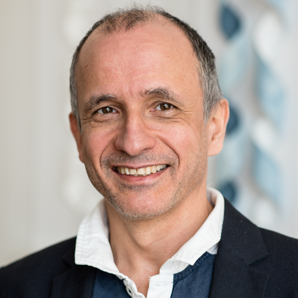

# [DisCoTec 2019](https://www.discotec.org/2019)  - ICE Keynotes

## [Dilian Gurov](https://www.csc.kth.se/~dilian/) (KTH, SE)

**Title**: Program Models for Compositional Verification 

**Abstract**: Verification of procedural programs typically faces the problem of scalability. To tackle this problem, most tools for deductive verification are procedure-modular: every procedure is verified separately, in isolation, relying on the contracts of the procedures it calls. For temporal properties, however, modularity poses certain difficulties. In this talk we will show how procedure modularity can be achieved by using a program model called flow graphs. Flow graphs can be extracted from program code, but can also be constructed from logical specifications. In a first instalment of the framework, flow graphs will only model the control flow of programs. Extending the framework to also represent program data will lead us to use the concept of action, which in this context refers to a state change specified in logic. We will see that a similar approach allows us to also deal with concurrent programs, where actions model exclusive accesses to shared memory. 

**Bio**: Dilian Gurov received his PhD in 1998 from the University of Victoria, Canada, where he worked on compositional model checking of process-algebra models against specifications written in the modal mu-calculus. During his postdoc stay in Stockholm he continued this line of research, targeting the verification of Erlang programs. After joining KTH Royal Institute of Technology in 2002, Dilian has worked on a number of topics. His main body of work lies in the area of compositional and procedure-modular verification of programs with procedures. In particular, he developed a technique based on maximal models, which allows temporal properties of a program to be verified relative to the local temporal properties of its procedures. More recently, Dilian is working on contract theories for software specification and verification, within a collaboration with Scania on verifying automotive embedded C code.

## [Fritz Henglein](http://hjemmesider.diku.dk/~henglein/) (University of Copenhagen and Deon Digital, DK)

**Title**: Smart digital contracts

**Abstract**: The term 'smart contract' was informally introduced as ``a computerized transaction protocol that executes the terms of a contract'' (Szabo, 1994). It has been popularized in Ethereum, where it is an object encapsulating an account balance, written in a reactive, object-oriented programming language  that is executed on a decentralized replicated deterministic state machine (Buterin, 2014; Wood, 2014). Based on the REA accounting model (McCarthy, 1982) and a semantic model of contracts as event sequence classifiers (Andersen et al, 2006), we deconstruct a smart contract into a *digital contract* with a formal mathematical semantics that represents the terms of a contract; its *life-cycle management*, which executes, validates and monitors contract events; and its *resource management* (who owns what) in both decentralized (blockchain/distributed ledger) and centralized systems. We describe CSL, a compositional digital contract specification language in use and active development at Deon Digital (https://hub.docker.com/r/deondigital/vitznauerstock) and report on formalizing its denotational and operational semantics and proving their coherence in Coq as a basis for guaranteed sound static analysis and certified security guarantees. 

**Bio**: Fritz Henglein is Professor of Programming Languages and Systems at DIKU, the Department of Computer Science at the University of Copenhagen (UCPH) and Head of Research at Deon Digital AG, a start-up developing secure and scalable digital contract technology for both decentralized (blockchain, distributed ledger) and centralized systems. His research contributions are in semantic, logical and algorithmic aspects of programming languages, functional programming, domain-specific languages, digital contracts, reporting and analytics, smart contracts and blockchain/distributed ledger systems. Since 2015 he has served as general chair, program committee member and steering committee member of programming language conferences (including POPL, ICFP, PEPM, FHPC); as editor/ editorial board member of Journal of Functional Programming; as steering committee chair of the Danish Innovation Network for Finance IT; Kurator at Fraunhofer Institute of Software and Systems Technology; Mercator Fellow at TU Dortmund; member of IFIP Working Groups 2.1 and 2.8; co-founder and advisory board member of several start-ups; and in a variety of roles at the department, faculty and university level at the University of Copenhagen.

## [Sophia Knight]() (University of Minnesota Duluth, USA)

**Title**: Toward a Formal Model of Social Networks and Polarization

**Abstract**: We will present a preliminary model for social networks, and a measure of the level of polarization in these social networks, based on Esteban and Ray’s classic measure of polarization for economic situations. The models include information about each agent’s quantitative strength of belief in a proposition of interest and a representation of the strength of each agent’s influence on every other agent. We consider how the model changes over time as agents interact and communicate, and include several different options for belief update, including rational belief update and update taking into account irrational responses such as confirmation bias and the backfire effect. Under various scenarios, we consider the evolution of polarization over time, and the implications of these results for real world social networks.  I will discuss several directions for future work, including new polarization measures, probabilistic update, and an epistemic logic suited for this model of social networks. 

**Bio**: Sophia Knight is Assistant Professor at the University of Minnesota Duluth. Her research ranges over the relationship between knowledge, communication, information flow, and interaction in dynamic multi-agent systems, using tools from concurrency theory and epistemic logic. Sophia is interested in applying these ideas to problems in social networks and other multi-user online systems with personal data, as well as to security problems. She has studied these problems from several perspectives: various modal logics with an epistemic focus, process algebra, games, and topological models. She is currently working on a logic for analyzing the effects of asynchronous communication on knowledge as well as an epistemic version of strategy logic for modelling agents' abilities and knowledge under uncertainty. She is also developing a constraint programming language with modal information, in order to reason about knowledge and information flow among agents in a distributed system. With Aybüke Özgün, she has worked on topological semantics for dynamic epistemic logics.

## [Hernan Melgratti](http://lafhis.dc.uba.ar/en/~melgratti) (University of Buenos Aires - Conicet, AR)

**Title**: Petri nets, Probabilities and Bayesian reasoning

**Abstract**: In this talk we will explore the connections between Petri nets (PN) and Bayesian networks (BN). Despite these two models have different purpose, they share a similar structure, which becomes evident when equipping PN with a suitable probabilistic structure. We will show that this connection provides differnet views for the same model: the standard token game of the PN view gives a concrete, probabilistic computational model; while BN semantics allows us to reason about properties of the underlying concrete model.

**Bio**: Hernán Melgratti is an Adjoint Professor at the University of Buenos Aires and a researcher at the Instituto en Ciencias de la Computación, UBA & Conicet, Argentina. He obtained his PhD from University of Pisa, Italia. His research focuses on semantics foundations of concurrent and distributed systems.