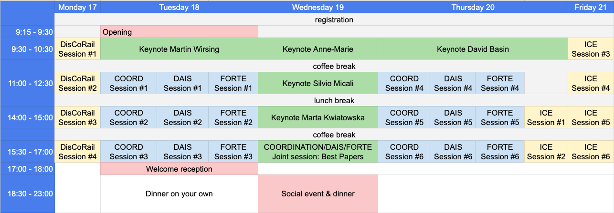

# [DisCoTec 2019](https://www.discotec.org/2019/) programme

## Location
All sessions from Monday to Thursday will take place at [DTU's Meeting Center](https://www.dtu.dk/english/About/CAMPUSES/DTU-LYNGBY-Campus/DTU-Meeting-Centre/oversigt) in building 101 (see [map](https://www.google.com/maps/search/dtu+meeting+centre/@55.7853049,12.5181051,17z/data=!3m1!4b1)). ICE on Friday will be at DTU Compute, in building 324 (see [map](https://www.google.com/maps/place/DTU+Compute/@55.783851,12.5162676,17z/data=!3m1!4b1!4m5!3m4!1s0x46524e635a3d9edf:0x3f650147a3cddb16!8m2!3d55.783851!4d12.5184616)).

- Joint sessions: Building 101, conference room M1, 1st floor.
- Coordination: Building 101, room S09, ground flor.
- DAIS: Building 101, room S01, ground floor.
- FORTE: Building 101, room M1, 1st floor.
- DisCoRail: Building 101, room S01, ground floor.
- ICE: Building 101, room S01, ground flor (Thursday) and Building 324, room 240, 2nd floor (Friday).
- Coffee breaks: Building 101, foyer (right outside conference room M1), 1st floor.

Details about the rooms are available [here](https://www.dtu.dk/english/About/CAMPUSES/DTU-LYNGBY-Campus/DTU-Meeting-Centre/oversigt).

## Social Event
Information about the social event are given in the [main page](https://www.discotec.org/2019/)

## Keynotes

[David Basin](https://www.inf.ethz.ch/personal/basin/) (ETH Zürich, Switzerland)  
[*Security Protocols: Model Checking Standards*](https://www.discotec.org/2019/keynotes#david-basin-eth-z%C3%BCrich-switzerland)

[Anne-Marie Kermarrec](https://www.irisa.fr/asap/?page_id=179) (INRIA Rennes, France)  
[*Making Sense of Fast Big Data*](https://www.discotec.org/2019/keynotes#anne-marie-kermarrec-inria-rennes-france)

[Marta Kwiatkowska](http://www.cs.ox.ac.uk/marta.kwiatkowska/) (University of Oxford, UK)  
[*Versatile Quantitative Modelling: Verification, Synthesis and Data Inference for Cyber-Physical Systems*](https://www.discotec.org/2019/keynotes#marta-kwiatkowska-university-of-oxford-uk)

[Silvio Micali](https://people.csail.mit.edu/silvio/) (MIT, USA)  
[*ALGORAND - The Distributed Ledger for the Borderless Economy*](https://www.discotec.org/2019/keynotes#silvio-micali-mit-usa)

[Martin Wirsing](https://www.sosy-lab.org/people/wirsing/) (LMU, Germany)  
[*Towards Formally Designing Collective Adaptive Systems*](https://www.discotec.org/2019/keynotes#martin-wirsing-lmu-germany)

## Joint session: Best Papers

**Coordination Best Paper**  
G. Michele Pinna  
*Representing dependencies in Event Structures*

**DAIS Best Paper**  
Lakhdar Meftah, Romain Rouvoy and Isabelle Chrisment  
*FOUGERE: User-Centric Location Privacy in Mobile Crowdsourcing Apps*

**FORTE Best Paper**  
Johannes Åman Pohjola  
*Psi-Calculi Revisited: Connectivity and Compositionality*

## Coordination accepted papers and programme

### Joint session: Best Papers
G. Michele Pinna  
*Representing dependencies in Event Structures*

### Coordination Session #1: Computational models (session chair: TBD)
Hernán Melgratti, Claudio Antares Mezzina and Irek Ulidowski  
*Reversing P/T Nets*

Wen Kokke, J. Garrett Morris and Philip Wadler  
*Towards Races in Linear Logic*

Giorgio Audrito, Jacob Beal, Ferrucciodi Damiani, Danilo Pianini and Mirko Viroli  
*The share operator for field-based coordination*

### Coordination Session #2: Tools 1 (session chair: TBD)

Jean-Marie Jacquet and Manel Barkallah  
*Scan : a Simple Coordination Workbench*

Marco Autili, Amleto Di Salle, Francesco Gallo, Claudio Pompilio and Massimo Tivoli  
*CHOReVOLUTION: automating the realization of highly-collaborative distributed applications*
   
### Coordination Session #3: Special topics (session chair: TBD)

Rocco De Nicola, Tan Duong and Michele Loreti  
*ABEL - A domain specific framework for programming with attribute-based communication*

Davide Basile, Maurice H. ter Beek and Rosario Pugliese  
*Bridging the Gap between Supervisory Control and Coordination of Services: Synthesis of Orchestrations and Choreographies*

Maurizio Gabbrielli, Saverio Giallorenzo, Ivan Lanese, Fabrizio Montesi, Marco Peressotti and Stefano Pio Zingaro  
*No more, no less: a formal model for Serverless Computing*

### Coordination Session #4: Coordination patterns (session chair: TBD)

Simon Bliudze, Ludovic Henrio and Eric Madelaine  
*Verification of concurrent design patterns with data*

Roberto Casadei, Danilo Pianini, Mirko Viroli and Antonio Natali  
*Self-organising Coordination Regions: a Pattern for Edge Computing*

Roberto Casadei, Mirko Viroli, Giorgio Audrito, Danilo Pianini and Ferruccio Damiani  
*Aggregate Processes in Field Calculus*

### Coordination Session #5: Tools 2 (session chair: TBD)

Agustín Eloy Martinez Suñé and Carlos Gustavo Lopez Pombo  
*Automating Quality-of-Service evaluation in Service-Oriented Computing*

Roberto Guanciale  
*DiRPOMS: automatic checker of Distributed Realizability of POMSets*

Guillermina Cledou, Jose Proença, Bernhard Sputh and Eric Verhulst  
*Coordination of tasks on a Real-Time OS*

## DAIS accepted papers and programme

### Joint session: Best Papers
Lakhdar Meftah, Romain Rouvoy and Isabelle Chrisment  
*FOUGERE: User-Centric Location Privacy in Mobile Crowdsourcing Apps*

### DAIS Session #1 (session chair: TBD)
Marius Shekow 
*Syncpal: A simple and iterative reconciliation algorithm for file synchronizers*

Lance Lebanoff, Christina Peterson and Damian Dechev 
*Check-Wait-Pounce: Increasing Transactional Data Structure Throughput by Delaying Transactions*

Kevin De Porre, Florian Myter, Christophe De Troyer, Christophe Scholliers, Wolfgang De Meuter and Elisa Gonzalez Boix 
*Putting Order in Strong Eventual Consistency*

### DAIS Session #2 (session chair: TBD)
Sam Van den Vonder, Joeri De Koster and Wolfgang De Meuter 
*Composable Actor Behaviour*

István Hegedűs, Gábor Danner and Mark Jelasity 
*Gossip Learning as a Decentralized Alternative to Federated Learning*

### DAIS Session #3 (session chair: TBD)

Carlos Segarra, Ricard Delgado-Gonzalo, Mathieu Lemay, Pierre-Louis Aublin, Peter Pietzuch and Valerio Schiavoni 
*Using Trusted Execution Environments for Secure Stream Processing of Medical Data*

Zoltán Szabó, Árpád Berta, Krisztián Téglás, Márk Jelasity and Vilmos Bilicki 
*Stunner: A Smart Phone Trace for Developing Decentralized Edge Systems*

### DAIS Session #4 (session chair: TBD)

Julien Amacher and Valerio Schiavoni 
*On The Performance of ARM TrustZone*

Stefano Bistarelli, Claudio Pannacci and Francesco Santini 
*CapBAC in Hyperledger Sawtooth*

Christian Göttel, Pascal Felber and Valerio Schiavoni 
*Developing Secure Services for IoT with OP-TEE: A First Look at Performance and Usability*

## FORTE program

### Joint session: Best Papers

Johannes Åman Pohjola  
*Psi-Calculi Revisited: Connectivity and Compositionality*

### FORTE Session #1: Calculi, Languages, and Components (session chair: Jorge A. Pérez)
Ivan Lanese, Adrian Palacios and German Vidal  
*Causal-Consistent Replay Debugging for Message Passing Programs*

Thomas Hildebrandt, Hugo A. López, Tijs Slaats, Søren Debois and Marco Carbone  
*Declarative Choreographies and Liveness*

Alexander Graf-Brill and Holger Hermanns  
*Component-aware Input-Output Conformance*

### FORTE Session #2: Automata (session chair: Thomas Hildebrandt)
Étienne André, Didier Lime and Mathias Ramparison  
*Parametric updates in parametric timed automata*

The Anh Pham, Thierry Jéron and Martin Quinson  
*Unfolding-based Dynamic Partial Order Reduction of Asynchronous Distributed Programs*

### FORTE Session #3: Security (session chair: TBD)

Cristian Ene, Mounier Laurent and Marie-Laure Potet  
*Output-sensitive Information flow analysis*

Chandrika Bhardwaj and Sanjiva Prasad  
*Only Connect, Securely*

Stefano Calzavara, Alvise Rabitti and Michele Bugliesi  
*Semantically sound analysis of content security policies* (Journal-first)

### FORTE Session #4: Software Architectures (session chair: TBD)

Giorgio Audrito, Mirko Viroli, Ferruccio Damiani, Danilo Pianini and Jacob Beal  
*On a Higher-order Calculus of Computational Fields* (Journal-first)

Jean-Bernard Stefani and Martin Vassor  
*Encapsulation and Sharing in Dynamic Software Architectures: The Hypercell Framework*

Diego Marmsoler  
*Towards Verified Blockchain Architectures: A Case Study on Interactive Architecture Verification*

### FORTE Session #5: Model Checking and Verification (I) (session chair: TBD)

Ran Bao, Christian Attiogbe, Benoit Delahaye, Paulin Fournier and Didier Lime  
*Parametric statistical model checking of UAV flight plan*

Dung Tran, Luan Nguyen, Patrick Musau, Weiming Xiang and Taylor T Johnson  
*Decentralized Real-Time Safety Verification for Distributed Cyber-Physical Systems*

Kim Völlinger  
*On Certifying Distributed Algorithms: Problem of Local Correctness*

### FORTE Session #6: Model Checking and Verification (II) (session chair: Sophia Knight)

Maurice Laveaux, Jan Friso Groote and Tim A.C. Willemse  
*Correct and Efficient Antichain Algorithms for Refinement Checking*

Karine Altisen, Pierre Corbineau and Stéphane Devismes  
*Squeezing Streams and Composition of Self-Stabilizing Algorithms*

Jannik Hüls and Anne Remke  
*Model checking HPnGs in multiple dimensions: representing state sets as convex polytopes*

### DisCoRail Programme (Monday 17 June)
(see abstracts, coauthors and details [here](https://www.discotec.org/2019/DisCoRailAbstracts.pdf))

#### 9:00-9:15 Registration

#### 9:15-10:45 Distributed Interlocking 
Jan Peleska, University of Bremen, Germany  
*New Distribution Paradigms for Railway Interlocking*

Signe Geisler, DTU Compute, Denmark  
*Stepwise Development and Model Checking of a Distributed Interlocking System - Using RAISE*

Per Lange Laursen and Van Anh Thi Trinh, DTU Compute, Denmark  
*Modelling and Verification of a Distributed Interlocking System - Using UPPAAL and UMC*

Paulius Stankaitis, Newcastle University, UK  
*Formal distributed protocol development for reservation of railway subsections*

#### 10:45-11:10 Coffee break  

#### 11:10-12:00 Formal methods and tools 
Thierry Lecomte, Clearsy, France  
*Formal Techniques for Safer Signalling Systems*

Anne Haxthausen, DTU VCompute, Denmark  
*The RobustRailS tool set*

#### 12.00-13:10 Lunch 

#### 13:10-14:10 Security and Blockchain technology  
Jens Braband, Siemens Mobility GmbH, Germany  
*A Survey of Cybersecurity in Signaling*

Michael Kuperberg, Deutsche Bahn Systel Gmbh, Germany  
*Towards a Systematic Selection of a Blockchain Implementation for a Decentralized Rail Control System*

#### 14:10-14:35 Coffee break  

#### 14:35-16:15 Moving block, Virtual coupling and positioning systems  
Francesco Flammini, Linnæus University, Sweden  
*Towards Railway Virtual Coupling*

Davide Basile, Univ. of Florence, Italy  
*Statistical model checking of hazards in an autonomous tramway positioning system*

Franco Mazzanti, ISTI-CNR, Italy  
*Modelling a Moving Block train control system: different techniques and tools*

Markus Roggenbach, Swansea University, UK  
*Modelling and Verification of ERTMS – A Comparison of KeYmaera, Real-Time Maude, and UPPAAL*

#### 16:15-16:45 Discussions 

