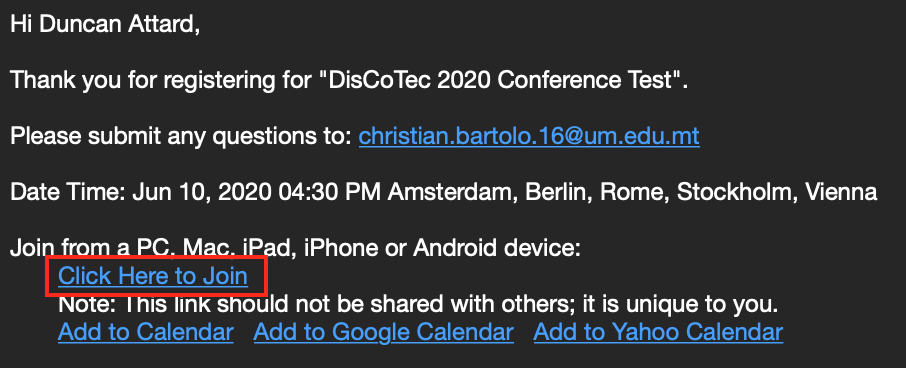
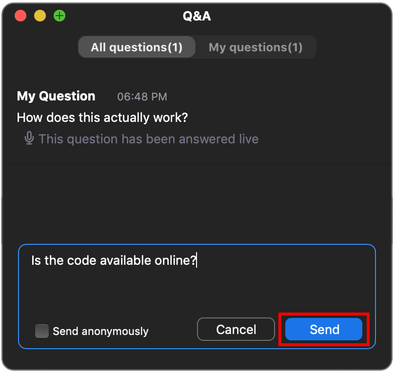
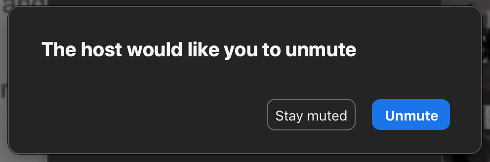

# Instructions for all Attendees

**Download and install the Zoom client if not yet installed.**

An ongoing Zoom webinar can be joined by following these instructions. Individuals who plan to attend the tutorials should, **in addition**, observe the instructions [below](#Tutorials).

1. To join a webinar, click the `Click Here to Join` link that you received in your email communication.

    {:height="75%" width="75%"}

2. The Zoom client window should pop up.

    {:height="50%" width="50%"}

3. If the webinar has not yet started, wait for the host to start the meeting, otherwise you will be connected automatically.

4. During presentations, attendees may ask questions by clicking the `Q&A` button.

    {:height="50%" width="50%"}

5. The `Q&A` panel shown pops up. This panel organises questions in two tabs: `All questions` and `My questions`. 

    {:height="50%" width="50%"}

    `All questions` lists the questions that **have been answered** by the presenter; these will be visible to all webinar attendees. The `My questions` tab shows the questions that you have asked. To pose a question to the presenter, simply type the question and press `Send`. The presenter receiving your question may then choose to address your question. Questions will be answered by presenters live over the mic. Any questions that remain unaddressed by presenters will only be visible in your `Q&A` panel, but are not seen by others.

6. If and when your question is addressed by the presenter, you will be automatically given the option to **unmute your mic** in case you wish to pose further follow up questions. Press `Unmute` to enable your mic.

    {:height="50%" width="50%"}

    At any point, the *session chair* may intervene to help steer the discussion or provide additional clarification.    

7. Once your question has been addressed, your mic will be muted automatically.

## Tutorials

During tutorials, you may wish to share your screen when asking for detailed assistance.

Follow steps 1-7 above when asking questions to tutors. To request a screen share, simply ask your host over the mic, and you will be granted permission accordingly.

> **TODO:** Pic on how to share screen.

<!-- Click *Raise Hand* to inform the presenter that you would like to share your screen.

{:height="50%" width="50%"} -->

<!-- Questions posed by attendees will appear in the *Q&A* popup window as shown. The popup has two tabs *All questions* and *My questions*; *All questions* shows all the available questions which the speaker may choose to address or otherwise. Answered questions become visible by the audience once answered, and may be viewed in the *My questions* tab. -->