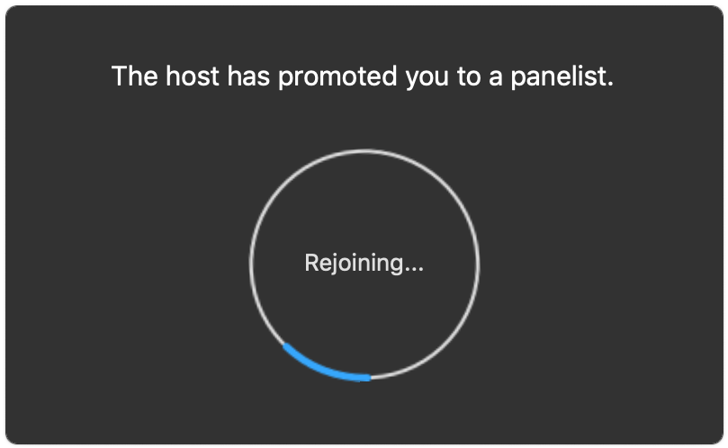
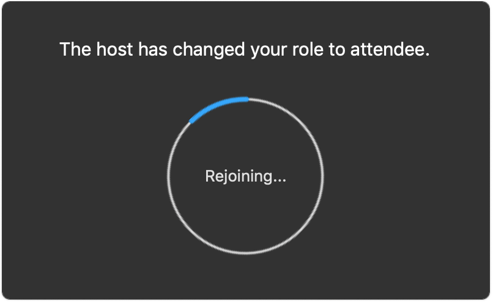
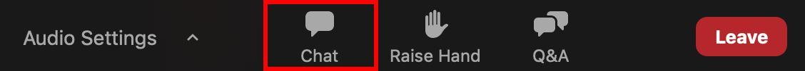
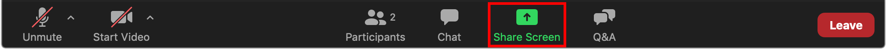
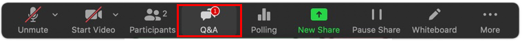
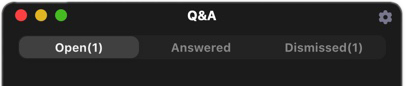
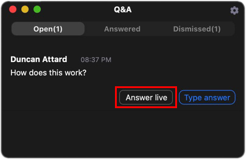
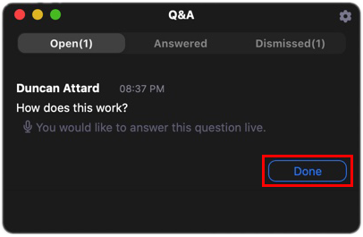
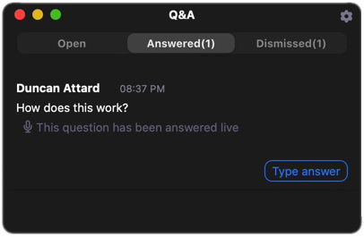

# Instructions for Invited, Conference, Tutorial and Workshop Speakers

We strongly encourage you to download and install the [Zoom client](https://zoom.us) before the conference, to resolve any unforeseen problems you may encounter ahead of time. 

Presentations will be hosted by *session hosts* and shall be streamed via Zoom in the form of **prerecorded videos**. The video links will be made publicly available at the end of each day. Should you **not** wish to have your talk made public, please inform us accordingly via email. However, we strongly encourage presenters to make their talk public.

*Presenters* will be promoted to the role of *Zoom panelist* before their talk commences. This enables them to manage and reply to questions posted by *attendees*. *Session chairs* will be likewise promoted, but should refrain from answering or moderating questions unless absolutely necessary. 

{:height="50%" width="50%"}

While both *session chairs* and *presenters* can access the questions posted, *attendees* will be able to see only the questions that the *presenter* has answered. *Attendees* have been instructed to post questions using the Q&A functionality.

*Presenters* will be demoted back to the role of *attendee* once their talk ends. *Session chairs* will be demoted to said role once the session ends.

{:height="50%" width="50%"}

## Presenting Content

The prerecorded presentation videos shall be aired by the *session host* via screen share. Once the presentation is over, the *session host* will stop the screen sharing session. At this point, the *presenter* may start addressing the questions that were posted whilst the presentation was in progress. 

## Presenter's Checklist

We recommend that *presenters* follow this checklist.

#### Before Session Starts

1. Alert the *session hosts* via chat. The chat can be accessed using the `Chat` button. This should be done around **15 minutes** before the start of the **session**. Please make sure to include the title of the presentation. This informs the *session hosts* of whom to promote to the role of *Zoom panelist*.

    {:height="50%" width="50%"}

2. Have the presentation slides at hand, in case attendees post questions in reference to these slides.

#### After the Presentation is Aired

Presenters can now start addressing questions. Refer to [below](#answering-questions) for instructions on how to answer questions.

1. Enable the mic to respond to questions.

2. Enable the webcam so that attendees can see the presenter.

3. You may start a screen sharing session when reference to the presentation is required.

    {:height="75%" width="75%"}

## Answering Questions

The following procedure should be used to address questions:

1. Click the `Q&A` from the Zoom dock. The dock is located at the top or bottom part of your screen.

    {:height="75%" width="75%"}

2. The `Q&A` panel pops up. This panel organises questions in three tabs: `Open`, `Answered` and `Dismissed`. `Open` lists the questions that have not yet been answered; these are visible **only** to the session chair and speaker. The `Answered` tab shows the questions that have already been answered, whereas dismissed questions can be found in the `Dismissed` tab.

    {:height="50%" width="50%"}
    
3. Choose a question to address from the `Open` questions list, and click `Answer live`. Make sure your mic is **unmuted** before answering.

    {:height="50%" width="50%"}

4. The *session host* will unmute the mic of the attendee asking the question in case follow up questions need to be asked verbally.

5. After you have answered the question, together with any follow up questions, complete the answering process by clicking `Done`.

    {:height="50%" width="50%"}

    At any point, the *session chair* may intervene to help steer the discussion or provide additional clarification.    

    The answered question is moved to the `Answered` tab.

    {:height="50%" width="50%"}

6. After clicking `Done`, you may proceed to answering the next question from the list by following steps 1-6.

Questions that remain unaddressed will not be visible to *attendees*, only to *session chairs*.

# Instructions for Session Chairs

Before the start of each session, *session chairs* will be promoted to the role of *Zoom panelist*.

As a *session chair*, you will at all times, have an open mic to introduce presenters and steer the discussion during the Q&A session.

<!-- # Instructions for Us

To handle questions:

1. Once the speaker presses answer live, this will be shown on the screen

2. We should unmute the asker of the question, so that he can ask follow up questions. Once the question has been answered we unmute the asker. -->

