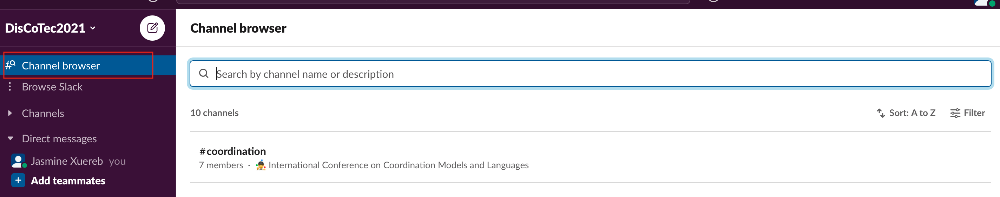
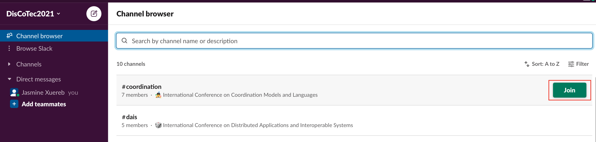
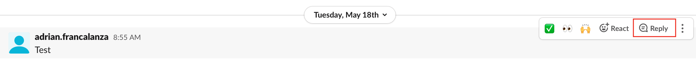
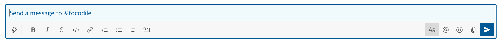
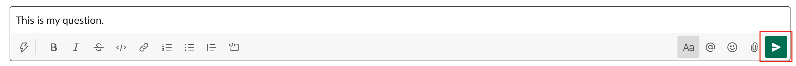

# Instructions on using the Slack Workspace 

We strongly encourage you to join the DisCoTec2021 slack workspace and join the dedicated channels before the conference, to resolve any unforeseen problems you may encounter ahead of time by following these instructions. 

## Joining the Slack Workspace

1. Click on [DisCoTec 2021 Slack](https://discotec2021.slack.com/join/shared_invite/zt-qd3ed8l2-BC1WA_re3N~e6AjNbFNIzQ).

2. Join the slack workspace using your preferred method.

    {:height="50%" width="50%"}

3. You will be redirected to the DisCoTec2021 Channel.

    {:height="50%" width="50%"}

## Joining a Slack Channel

1.  Click ``Channel browser`` at the top of your left sidebar. If you don't see this option, click ``More`` to find it.

    {:height="85%" width="85%"}

2. Browse the list of public channels in your workspace, or use the search bar to search by channel name or description.

3. Select a channel from the list to view it.

4. Click ``Join``.

    {:height="85%" width="85%"}

## Posting questions 

1. If your question is related to a particular presentation, check whether there is an existing thread using the search field at the top of the page.

    {:height="85%" width="85%"}

2. If there is an existing thread, post your question in that thread by clicking ``Reply``.

    {:height="85%" width="85%"}

3. Otherwise, if there is no existing thread or your question is not related to a particular presentation, navigate to the channel where you wish to post your question. 

4. Type in your question in the dialog box at the bottom of the page. 

    

5. If your question is directed to a specific person, enter the @ symbol. Then enter the member's name or select one from the list of members. Repeat this step for every person you'd like to address. 

6. Post your question by clicking on the ``Send`` button at the right most corner of the dialog box.

    {:height="85%" width="85%"}

