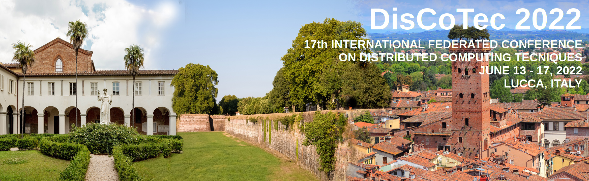

# Call for Satellite Events Proposals: Workshops and Tutorials  — DisCoTec 2022

DisCoTec 2022 is one of the major events sponsored by the International Federation for Information Processing (IFIP) and the European Association for Programming Languages and Systems (EAPLS). It gathers conferences and workshops that cover a broad spectrum of distributed computing subjects — from theoretical foundations and formal description techniques, testing and verification methods, to language design and system implementation approaches.

Pre-conference workshops and tutorials will take place on **Monday, June 13, 2022**, and post-conference workshops on **Friday, June 17, 2022**.

Submissions of workshop proposals must reach the workshop chairs by **December 21, 2021**.

**COVID-19 pandemic:** DisCoTec 2022 should take place physically in Lucca. Anyway, we are monitoring the COVID-19 pandemic development and are prepared to run the conferences and the satellite events virtually or in a hybrid fashion in the unfortunate situation that a physical event is not feasible. The paper selection process and the publication of proceedings will not be affected regardless of whether the event is held physically, virtually or in a hybrid fashion.

## Workshops 

The DisCoTec 2022 organising committee solicits proposals for workshops to provide a vivid and open forum for discussions among active researchers on topics related to the distributed computing field. The aim is to facilitate the exchange of ideas and experiences via presentations of preliminary research results and ongoing works, as well as presentations of research work to a focussed audience. 

A workshop associated with DisCoTec 2022 can be one-day or half-day in length. Workshop registration will be done together with the main conferences, allowing workshop-only registrations as well. 

A workshop proposal must include the following information:
  - name of the workshop
  - contact information of the Workshop Chair(s)
  - brief description of the aim and scope of the workshop (max. 500 words)
  - tentative Program and Organization Committees, if available
  - number of (expected) submissions and/or attendees  
  - history of the workshop, if any, including the numbers of submissions, 
    accepted papers, and attendees of the last edition
  - any other relevant information (e.g., invited speakers, panels)

**Important dates (for all workshops)**:
  - December 21, 2021: Workshop proposal submission deadline
  - December 27, 2021: Notification of accepted workshop proposals
  - Mid April 2022: Workshop paper submission deadline
  - Mid May 2022: Notification of accepted workshop papers
  - June 13 and 17, 2022: Workshops

The submission and notification deadlines of the workshops are at the discretion of the individual workshop chairs. However, the notification must be no later than the early registration deadline for DisCoTec 2022 (to be announced).

**Submission**
Workshop proposals can be submitted to the Workshop Chair via the following form:

<https://forms.gle/TDAfKLT7q6rHvveM7>

## Tutorials 

The DisCoTec 2022 organising committee encourages proposals for tutorials to complement the   program of the main conferences and co-located workshops. The scope of a tutorial should focus on emerging topics and aspects of the distributed computing field, ranging from new practical techniques and technologies to lessons learnt from projects and industry experiences. No marketing or product-specific tutorials will be accepted. 

A tutorial associated with DisCoTec 2022 can be short (1 session lasting up to 1.5 hours) or long (2 sessions lasting up to 3 hours in total). Tutorials will be included in both full and workshop-only registrations. 

A tutorial proposal must include the following information:
  - title of the tutorial
  - contact information and short bio of the tutorial speaker(s)
  - brief description of the aim and scope of the tutorial (max. 500 words)
  - brief discussion about why the tutorial topic is relevant to the 
    DisCoTec community  (max. 200 words)
  - intended audience (academics, students, practitioners, etc.)
  - any prior experience for the speaker(s) giving this or related tutorial

**Important dates (for all tutorials)**:
  - February 28, 2022: Tutorial proposal submission deadline
  - March 07, 2022: Notification of accepted workshop proposals
  - June 13, 2022: Tutorials

**Submission**
Tutorial proposals can be submitted to the Workshops and Tutorials Chair via the following form:

<https://forms.gle/U8Ki5rQEYZJCjB7C8>

## Proposal Evaluation Criteria 
  
  - Interest and relevance for the DisCoTec community
  - Impact of the topic
  - The novelty with respect to other workshops and tutorials
  - Experience of the proposer(s)
  - Quality of the proposal

## Further Information

For further information please contact the Workshops and Tutorials Chair at <francesco.tiezzi@unifi.it>.

To receive live, up-to-date information, follow us on Twitter @DisCoTecConf.
