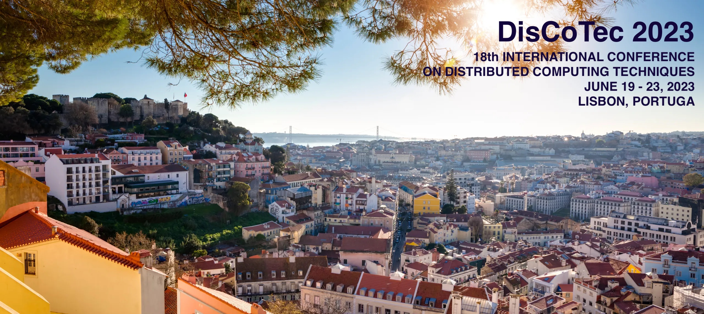

# DisCoTec 2023 - 18th International Federated Conference on Distributed Computing Techniques

[DisCoTec](https://www.discotec.org) 2023 is one of the major events sponsored by the International Federation for Information Processing ([IFIP](http://www.ifip.org)) and the European Association for Programming Languages and Systems ([EAPLS](https://eapls.org)). It gathers conferences and workshops that cover a broad spectrum of distributed computing subjects — from theoretical foundations and formal description techniques, testing and verification methods, to language design and system implementation approaches.

DisCoTec 2023 will take place at the [NOVA University Lisbon](https://www.unl.pt/en), between June 19-23, 2023.  

<!--**COVID-19:** DisCoTec 2022 is planned as a physical, in-person event, with certain support for remote presence, 
both for speakers and for other participants who are unable or unwilling to come. Depending on the 
pandemic situation, we may have to make a decision on whether to cancel the physical component of the 
event or not.-->

<!--
Due to the current COVID-19 developments, the conference is still hosted by the [University of Malta](http://www.um.edu.mt) but it will be held **online**.  Instead of physical meetings/presentations, the authors of accepted papers have recorded their talks to discuss them with the conference participants online.-->

 

## Programme

To be defined.

<!--Go to the [programme page](https://www.discotec.org/2022/programme). *All times are listed for* **CEST** *(Central European **Summer** Time)* 
-->

<!--
## Discussions

Go to the [DisCoTec2021 Slack workspace](https://join.slack.com/t/discotec2021/shared_invite/zt-qd3ed8l2-BC1WA_re3N~e6AjNbFNIzQ)

## Instructions for Attendees and Presenters

* Attendee instructions may be found [here](https://www.discotec.org/2021/attendees). 
<!-- *Registered participants should have all received an email with the webinar invitations by now. In the eventuality that your email was lost or blocked, you can still register for the webinars from the links provided on the [programme page](https://www.discotec.org/2021/programme) on the day of the respective webinar.* -->
<!--
* Presenter instructions may be found [here](https://www.discotec.org/2021/presenters#instructions-for-invited,-conference,-tutorial-and-workshop-speakers).
* Session Chair instructions may be found [here](https://www.discotec.org/2021/presenters#instructions-for-session-chairs).
<!-- * Any technical difficulties may be posted on the dedicated [Slack workspace](https://join.slack.com/t/discotec2021/shared_invite/zt-qd3ed8l2-BC1WA_re3N~e6AjNbFNIzQ).  -->
<!--
* Any technical difficulties may be posted on the dedicated [Slack workspace](https://join.slack.com/t/discotec2021/shared_invite/zt-qd3ed8l2-BC1WA_re3N~e6AjNbFNIzQ). Further instructions may be found [here](https://www.discotec.org/2021/slack).
* Follow us on [@DisCoTecConf](https://twitter.com/DisCoTecConf) to keep up to date.

-->

## Conferences
* [COORDINATION 2023](https://www.discotec.org/2023/coordination) - International Conference on Coordination Models and Languages
* [DAIS 2023](https://www.discotec.org/2023/dais) - International Conference on Distributed Applications and Interoperable Systems
* [FORTE 2023](https://www.discotec.org/2023/forte) - International Conference on Formal Techniques for Distributed Objects, Components, and Systems

## Important Dates
* **Abstract submission:** February 3, 2023
* **Paper submission:** February 10, 2023
* **Paper notification:** March 31, 2023
* **Camera-ready:** April 30, 2023
* **DisCoTec conference:** June 19-23, 2023

## Keynote Speakers

To be announced.

<!--
* [Muffy Calder](invited#muffy-calder), University of Glasgow, UK
* [Maarten van Steen](invited#maarten-van-steen), University of Twente, NL 
* [Moshe Y. Vardi](invited#moshe-y-vardi) (Remote), Rice University, USA
* [Luca Viganò](invited#luca-viganò), King's College London, UK
-->

<!--
## Accepted Papers
Go to the [list of accepted papers](accepted-papers)
-->

## Satellite Events
<!--
[Call for Satellite Events Proposals](csep): We invite the community to submit proposals for ~~one day workshops and~~ tutorials on topics related to the distributed computing field. 

 
### Important Dates
For all workshops:
- ~~**Workshop proposal submission deadline (first round)** December 21, 2021~~ 
- ~~**Notification of accepted workshop proposals (first round):** December 27, 2021~~ 
- ~~**Workshop proposal submission deadline (second round):** January 24, 2022~~
- ~~**Notification of accepted workshop proposals (second round):** January 31, 2022~~
- **Workshop paper submission deadline:** Mid April 2022
- **Notification of accepted workshop papers:** Mid May 2022 
- **Workshops:** June 13 and 17, 2022 

For all tutorials:
- **Tutorial proposal submission deadline:** February 28, 2022 
- **Notification of accepted tutorial proposals:** March 07, 2022
-->
DisCoTec 2023 gathers tutorials and workshops that cover a broad spectrum of distributed computing subjects — from theoretical foundations and formal description techniques, testing and verification methods, to language design and system implementation approaches.

Pre-conference workshops and tutorials will take place on **Monday, June 19, 2023**, and post-conference workshops on **Friday, June 23, 2023**.

<!--
### Tutorials
* [DisCoTec Tutorials](tutorials) -  Tutorial sessions
-->

<!--
### Workshops
-->

<!--
* [BlockTEE 2022](https://www.discotec.org/2022/blocktee) - Workshop on Blockchain Technologies and 
Trusted Execution Environments
* [CoMinDs 2022](https://www.discotec.org/2022/cominds) - Workshop on Collaborative Mining for Distributed Systems
* [FOCODILE 2022](https://www.discotec.org/2022/focodile) - Workshop on the Foundations of Consensus and Distributed Ledgers
* [ICE 2022](https://www.discotec.org/2022/ice) - Workshop on Interaction and Concurrency Experience
* ~~[REMV 2022](https://www.discotec.org/2022/remv) - Workshop on Robotics, Electronics and Machine Vision~~ **Cancelled**
-->

<!--

* [DisCoTec Tools](https://www.discotec.org/2021/tutorials) - Tutorial Sessions 

-->

## Proceedings
The proceedings of the conferences are published in [LNCS-IFIP](https://www.springer.com/series/8345) volumes. These shall be open access from the [IFIP digital library](https://hal.inria.fr/IFIP/page/conferences) after a 3-year embargo.

<!--
* COORDINATION: [LNCS13271](https://link.springer.com/book/9783031081453)
* DAIS: [LNCS13272](dais-informal-procs/)
* FORTE: [LNCS13273](https://link.springer.com/book/9783031086809)
-->

<!-- 
## IFIP Best Paper Award

- *A true concurrent model of smart contracts executions*   by Massimo Bartoletti, Letterio Galletta and Maurizio Murgia   
 [Paper](https://link.springer.com/chapter/10.1007/978-3-030-50029-0_16), [presentation](https://www.youtube.com/watch?v=vgoDvMa69cU&feature=youtu.be) and [award](DisCoTec-bpa-certificate.pdf)

-->

## Special issues
The individual conferences will organise special issues of extended and selected papers in reputable journal such as [Logical Methods in Computer Science](https://lmcs.episciences.org) and of [Science of Computer Programming](https://www.journals.elsevier.com/science-of-computer-programming/)'s [Software Track](https://www.journals.elsevier.com/science-of-computer-programming/call-for-software/a-new-software-track-on-original-software-publications-science-of-computer-programming) for tool papers.

<!--### DisCoTec Special Issues (published/appearing this year)
####  Coordination 2020 Special Issue 
- [Architectures in parametric component-based systems: Qualitative and quantitative modelling](https://lmcs.episciences.org/8901) by Maria Pittou and George Rahonis

- [A new operational representation of dependencies in Event Structures](https://lmcs.episciences.org/8791) by G. Michele Pinna

- [Time-Fluid Field-Based Coordination through Programmable Distributed Schedulers](https://lmcs.episciences.org/8755) by Danilo Pianini, Roberto Casadei, Mirko Viroli, Stefano Mariani and Franco Zambonelli

- [A theory of transaction parallelism in blockchains](https://lmcs.episciences.org/9031) by Massimo Bartoletti, Letterio Galletta and Maurizio Murgia

- [Verifying liquidity of recursive Bitcoin contracts](https://lmcs.episciences.org/9031) by Massimo Bartoletti, Stefano Lande, Maurizio Murgia and Roberto Zunino

- [Specification and Verification of Timing Properties in Interoperable Medical Systems](https://lmcs.episciences.org/9639) by Mahsa Zarneshan, Fatemeh Ghassemi, Ehsan Khamespanah, Marjan Sirjani and John Hatcliff
-->

## Scientific Committees 

### Coordination Program Committee Chairs
* [Antónia Lopes][AntoniaWeb] (University of Lisbon, PT)
* [Sung-Shik Jongmans][Sung-ShikWeb] (Open University of the Netherlands, NL)

### DAIS Program Committee Chairs 
* [Marta Patino-Martínez][MartaWeb] (Technical University of Madrid, ES)
* [João Paulo][JPauloWeb] (University of Minho, PT)

### FORTE Program Committee Chairs
* [Marieke Huisman][MariekeWeb] (University of Twente, NL)
* [António Ravara][AntonioWeb] (NOVA University Lisbon, PT)

<!--
*  IT — Chair of the Local Organizing Committee)
-->

## Organising Committee
* [Carla Ferreira][CarlaWeb] (NOVA University Lisbon, PT — General Chair)
* [João Costa Seco][JSecoWeb] (NOVA University Lisbon, PT)
* [João Leitão][JLeitaoWeb] (NOVA University Lisbon, PT)
* [Mário Pereira][MarioWeb] (NOVA University Lisbon, PT)
* [Simão Melo de Sousa][SimaoWeb] (University of Beira Interior, PT — Workshops and Tutorials Chair)
* [Carlos Baquero][CarlosWeb] (University of Porto, PT — Workshops and Tutorials Chair)

[CarlaWeb]: http://ctp.di.fct.unl.pt/~cf/
[JSecoWeb]: https://docentes.fct.unl.pt/jrcs/
[JLeitaoWeb]: https://www.joaoleitao.org/
[MarioWeb]: https://mariojppereira.github.io/
[SimaoWeb]: https://www.di.ubi.pt/~desousa
[CarlosWeb]: https://cbaquero.github.io/web/

[AntoniaWeb]: http://www.di.fc.ul.pt/~mal/
[Sung-ShikWeb]: https://sungshik.github.io/

[MartaWeb]: http://lsd.ls.fi.upm.es/Members/mpatino/
[JPauloWeb]: https://haslab.uminho.pt/jtpaulo

[MariekeWeb]: https://wwwhome.ewi.utwente.nl/~marieke/
[AntonioWeb]: http://ctp.di.fct.unl.pt/~aravara/

## Conference Venue
[NOVA University Lisbon](https://www.unl.pt/en/)
Campus de Campolide, Lisboa
<!--San Francesco Complex
Piazza S. Francesco, 19 - 55100 Lucca, LU -->

<!--### How to reach San Francesco Complex 

The San Francesco Complex is located in San Francesco square inside the ancient city walls.
You can reach the campus following [these directions](http://www.imtlucca.it/en/campus-and-services/how-to-reach-us). 

### Accommodations

Lucca is a small town, you can easily reach the San Francesco Complex from any accommodation inside the city walls.
You can find a list of Hotels and B&Bs nearby the conference venue [here](http://www.imtlucca.it/en/campus-and-services/services/special-deals#hotel-bb).

## Registration

Go to the [registration page](https://www.discotec.org/2022/registration).
-->
## Steering Committee
* Gianluigi Zavattaro (University of Bologna, IT — Chair)
* Rocco De Nicola (IMT School for Advanced Studies Lucca, IT)
* Kurt Geihs (University of Kasel, DE)
* Elie Najm (Telecom Paris Tech, FR)
* Mieke Massink (CNR-ISTI, IT)
* Luís Veiga (INESC-ID, Universidade de Lisboa, PT)
* Ivan Lanese (University of Bologna/INRIA, IT)
* Manuel Núñez (Universidad Complutense de Madrid, ES)
* Alberto Lluch Lafuente (Technical University of Denmark, DK)
* Adrian Francalanza (University of Malta, MT)

## Advisory board
* Alain Girault (INRIA Grenoble, FR)
* Uwe Nestmann (TU Berlin, DE)
* Michele Loreti (University of Camerino, IT)
* Jim Dowling (RISE & KTH, SE)
* Marjan Sirjani (University of Malarden, SE)
* Frank de Boer (Centrum Wiskunde & Informatica (CWI), NL)
* Farhad Arbab (Centrum Wiskunde & Informatica (CWI), NL)
* Lea Kutvonen (University of Helsinki, FI)
* John Derrick (University of Sheffield, UK)
* Pascal Felber (University of Neuchâtel, CH) 
* Kostas Magoutis (ICS-FORTH, GR)
* Rui Oliveira (University of Minho, PT)
* Jean-Bernard Stefani (INRIA Grenoble, FR)

<!--
## Registration
 Go to the [registration page](https://www.um.edu.mt/events/discotec2021/registration). -->

## Further information
For further information please contact the general chair at <carla.ferreira@fct.unl.pt>.

Follow us on [@DisCoTecConf](https://twitter.com/DisCoTecConf) to keep up to date.

## Sponsors & Supporters

&nbsp;   &nbsp;   &nbsp;   &nbsp;   &nbsp;
<a href="https://eapls.org">

<!--&nbsp;   &nbsp;   &nbsp;   &nbsp;   &nbsp;
 -->
