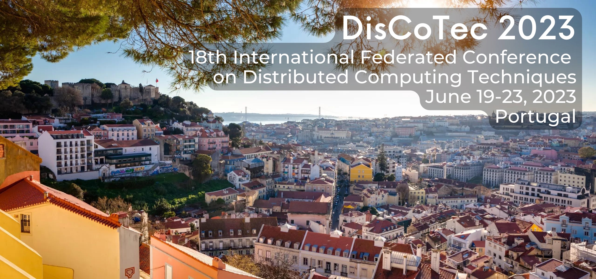

# FORTE 2023 - 43nd International Conference on Formal Techniques for Distributed Objects, Components, and Systems

FORTE 2023 is one of the three conferences of [DisCoTec 2023](https://www.discotec.org/2023/), the 18th International Federated Conference on Distributed Computing Techniques.

### Quick Links:
* [Important Dates](https://www.discotec.org/2023/#important-dates)
* [Topics of Interest](#main-topics-of-interest)
* [Submission Categories](#submission-categories)
* [Submission Link](#submission-link)
* [Special Issue](#special-issue)
* [Program Committee](#program-committee-chairs)
* [Contact](#more-information)

## Scope
FORTE 2023 is a forum for fundamental research on theory, models, tools, and applications for distributed systems.

The conference solicits original contributions that advance the science and technology for distributed systems, with special interest in:

* Component- and model-based design
* Cyber-physical systems, autonomous systems, and AI-enabled systems design and trustworthiness
* Object technology, modularity, software adaptation
* Self-stabilization and self-healing/organizing
* Software quality, reliability, availability, and safety
* Security, privacy, and trust in distributed and/or communicating systems
* Service-oriented, ubiquitous, and cloud computing systems
* Verification, validation, formal analysis, and testing of the above.

Aligned with the above, FORTE covers __models and formal specification__, __testing__ and __verification methods__ for distributed computing.  Application domains are multiple, and include all kinds of application-level distributed systems, telecommunication services, Internet, embedded and real-time systems, as well as networking and communication security and reliability.

Contributions that __combine theory and practice__ and that exploit formal methods and theoretical foundations to present novel solutions to problems arising from the development of distributed systems are very much encouraged.

## Main Topics of Interest
Topics of interest include but are not limited to:
 * __Languages and semantic foundations__

   New modeling and language concepts for distribution and concurrency; semantics for different types of languages, including programming languages, modeling languages, and domain-specific languages; real-time and probability aspects

* __Rigorous analysis techniques__

  Design, specification, analysis, verification, validation, testing and runtime verification of various types of distributed systems, including communications and network protocols, service-oriented systems, adaptive distributed systems, cyber-physical systems and sensor networks

* __Foundations of security__

  New principles for qualitative and quantitative security analysis of distributed systems, including formal models based on probabilistic concepts

* __Applications of formal methods__

  Applying formal methods and techniques for studying quality, reliability, availability, and safety of distributed systems

* __Practical experience with formal methods__

  Industrial applications, case studies and software tools for applying formal methods and description techniques to the development and analysis of real distributed systems.

* __Emerging challenges and hot topics in distributed systems__ (broadly construed)

  Formal specification, verification and  analysis of emerging systems and applications, such as, for instance, software-defined networks, distributed ledgers, smart contracts, and blockchain technologies.

## Submission, Publication, and Special Issue

### Submission dates

See the [DisCoTec submission dates](https://www.discotec.org/2023/#important-dates).

### Submission Guidelines
Contributions must be written in English according to one of the three categories described below. Apart from journal-first papers, all papers should report on original, unpublished work, not submitted for publication elsewhere (cf. [IFIP codes of conduct](http://www.ifip.org/index.php?option=com_content&task=view&id=219&Itemid=564), under Links).

Submissions must be prepared as a PDF using [Springer’s LNCS style](https://www.springer.com/gp/computer-science/lncs/conference-proceedings-guidelines). Submissions not adhering to the specified constraints of their respective category may be rejected without review.

### Submission Categories
FORTE accepts contributions in three categories: __full papers__, __short papers__, and __journal-first papers__. These categories and their associated criteria are described in detail below.

Notice that *short* and *journal-first* papers must be explicitly marked as such in the submission's title.

1. __Full papers__ (page limit: up to 15 pages + 2 pages references)

   A full paper submission describes thorough and complete research results in the scope of the conference.

2. __Short papers__ (page limit: up to 6 pages + 2 pages references)

   A short paper submission can be one of the following:
   * *Rough diamonds*: Extended abstracts presenting innovative and promising ideas, possibly in an early form and without supporting evidence.
   * *Tool (demonstration) papers*: Extended abstracts describing (or demonstrating) new tools (or tool components) that implement (or build upon) theoretical foundations.
   * *Position papers* : Extended abstracts describing (i) calls to action,  or (ii) substantiated reflections on current and/or future research perspectives related to FORTE.

3. Short paper submissions must be marked as such in the submission's title.

4. __"Journal First" papers__ (page limit: up to 4 pages, including references)

   This category aims at including published journal papers in the FORTE 2023 program. The objective is to offer FORTE attendees a richer program and further opportunities for interaction.

   Authors of published papers in high-quality journals can submit a proposal to present their journal paper in FORTE. The journal paper must adhere to the following four criteria:

   * It should be clearly in the scope of the conference.
   * It should be recent: only journal papers available  after January 1, 2021 (online or paper) can be presented.
   * It reports new research results that significantly extend prior work. As such, the journal paper does not simply extend prior work with material presented for completeness only (such as omitted proofs, algorithms, minor enhancements, or empirical results).
   * It has not been presented at, and is not under consideration for, journal-first programs of other similar conferences or workshops.

5. A journal-first submission is a concise but compelling summary of the published journal paper, which makes it clear why a related presentation would enrich the program of FORTE.

   Journal-first submissions must be marked as such in the submission's title, and must explicitly include pointers to the journal publication (such as a DOI) but also to related conference and workshop papers, as appropriate. They will be judged on the basis of the above criteria, but also considering relevance and the potential of enriching and complementing the conference program.

### Publication
All accepted papers, including short papers and journal-first submissions, will be published in the FORTE 2023 formal proceedings, which will appear in Springer's LNCS-IFIP volume series.
As such, they will be accessible free of charge from the [IFIP Digital Library](https://dl.ifip.org/) after a 3 years embargo.

### Special Issue
Selected papers will be invited to a special issue of [**Logical Methods in Computer Science**](https://lmcs.episciences.org).

## Submission Link
<https://easychair.org/conferences/?conf=forte2023>

## Program committee chairs 
* [Marieke Huisman](https://wwwhome.ewi.utwente.nl/~marieke/), University of Twente, Netherlands
* [António Ravara](http://ctp.di.fct.unl.pt/~aravara/), NOVA University Lisbon, Portugal

## Program committee members 
To be announced.

## Steering committee
* Ahmed Bouajjani (University Paris Diderot, France)
* Christel Baier (University Dresden, Germany)
* Frank de Boer (CWI, Netherlands)
* Luís Caires (Universidade Nova de Lisboa, Portugal)
* Alexey Gotsman (IMDEA Software Institute, Spain)
* Einar Broch Johnsen (University of Oslo, Norway)
* Ivan Lanese (University of Bologna/INRIA, Italy -- Chair)
* Jorge A. Pérez (University of Groningen, The Netherlands)
* Alexandra Silva (University College London, UK)
* Ana Sokolova (University of Salzburg, Austria)
* Jean-Bernard Stefani (INRIA, France)
* Nobuko Yoshida (Imperial College London, UK)
* Heike Wehrheim (Paderborn University, Germany)
* Tim Willemse (Eindhoven University of Technology, The Netherlands)

## More Information
For additional information, please contact the Program Committee Co-chairs: forte2023 at easychair dot org

## Sponsors & Supporters

&nbsp;   &nbsp;   &nbsp;   &nbsp;   &nbsp;

