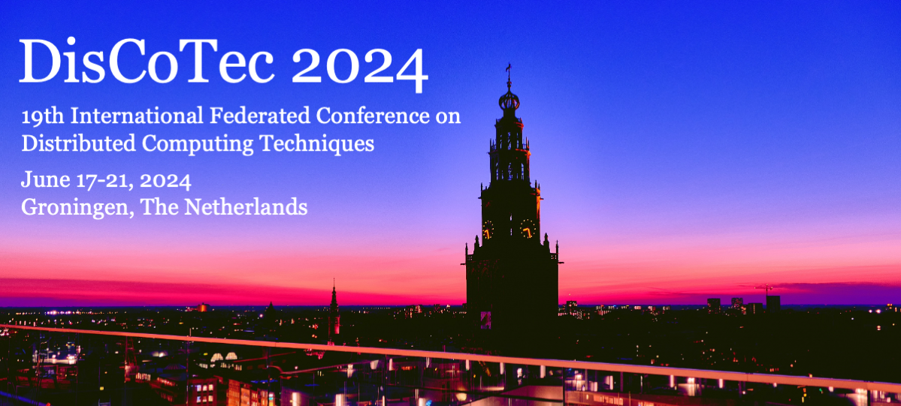

*Photo credit: Robin Mathlener via [Unsplash](https://unsplash.com/photos/black-concrete-building-during-night-time-3x-fuFPs-G0)* 

# Invited Speakers

We are pleased to announce the following keynote speakers. 
For further details, please visit the [programme page](https://www.discotec.org/2024/programme).

## Tuesday, June 18: [Laura Kovács](http://lkovacs.com)
Vienna University of Technology, Austria

### Automated Reasoning in BlockChain Security

We describe a game-theoretic framework for the security  analysis of blockchain protocols. 
We apply automated reasoning techniques to determine whether a game-theoretic protocol 
model is game-theoretically secure, that is, Byzantine fault tolerant and incentive compatible. 
Doing so, we reduce security analysis to satisfiability checking in first-order real arithmetic. 
Our approach is implemented in the CheckMate verifier and successfully applied to
decentralized protocols, board games, and game-theoretic examples.

## Wednesday, June 19: [Paulo Veríssimo](https://www.kaust.edu.sa/en/study/faculty/paulo-verissimo)
KAUST, Saudi Arabia

### Abstract

To be announced.

## Thursday, June 20: [Marieke Huisman](https://wwwhome.ewi.utwente.nl/~marieke/)  

University of Twente, The Netherlands

### VerCors: Inclusive Software Verification

VerCors supports deductive verification of concurrent software, written in multiple programming languages, where the specifications are written in terms of pre-/postcondition contracts using permission-based separation logic. Work on the VerCors verifier has started more than a decade ago. In this decade, the focus of the work on VerCors has shifted from verification of (concurrent) Java programs only to the development of a verifier that can support different programming languages, by exploiting their commonalities for developing efficient verification support.

In this talk, I will first give an overview of the VerCors verifier:
- how it is set up as a program  transformation tool that translates an annotated program into input for the Viper framework, which is then used as verification
back-end
- how it supports different programming languages and features, and
- how it has been used on different case studies (and how this has further improved VerCors).

In the last part of my talk, I will sketch my ideas and plans to further increase the inclusiveness of VerCors, so that it becomes easier to support new programming languages and to reuse the existing verification infrastructure in new settings.

## Sponsors & Supporters

<a href="https://www.nwo.nl">
&nbsp;&nbsp;</a> &nbsp;&nbsp;&nbsp; &nbsp;&nbsp;&nbsp;
