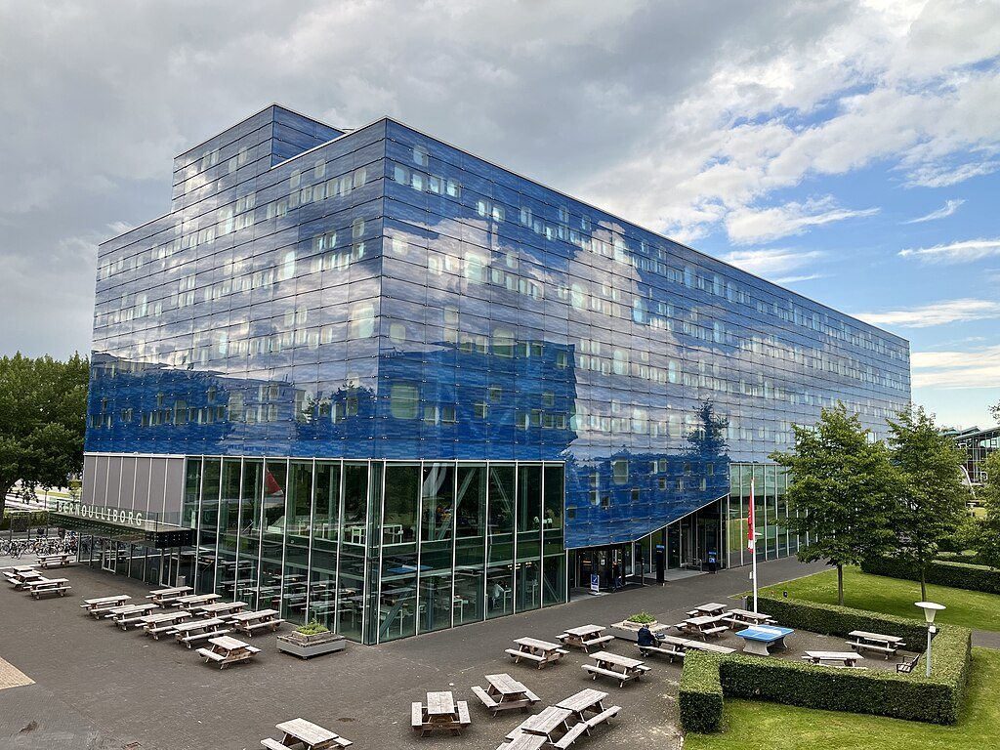

*Photo by Robin Mathlener on [Unsplash](https://unsplash.com/photos/black-concrete-building-during-night-time-3x-fuFPs-G0)* 

# Venue: Groningen, The Netherlands

## Location
DisCoTec 2024 will take place at the *Bernoulliborg* (Bernoulli building), one of the main buildings in the Zernike Campus of the University of Groningen. 

* *Address*:  Nijenborgh 9, 9747 AG Groningen (Bus stop: [Nijenborg](https://maps.app.goo.gl/3kyPY9j6sbjaa5kVA))
* Detailed information on how to reach the Bernoulliborg: [read here](https://www.rug.nl/staff/location/5161)

*<a href="https://commons.wikimedia.org/wiki/File:Bernoulliborg_2022.jpg">Laurensvanheerde</a>, <a href="https://creativecommons.org/licenses/by-sa/4.0">CC BY-SA 4.0</a>, via Wikimedia Commons*

## About Groningen

*Photo by Rick van Houten on [Unsplash](https://unsplash.com/photos/boat-on-river-near-green-trees-and-buildings-during-daytime-Ef3X7BBUFB8?utm_content=creditCopyText&utm_medium=referral&utm_source=unsplash)* 

The city of Groningen is the capital of the province of Groningen, the most north eastern province of the Netherlands. The largest urban center in the area  (230000 people), Groningen is a relatively undiscovered and unspoiled part of the Netherlands that has kept most of its authenticity.

Groningen is one of the happiest cities in Europe, and happiest small city in the Netherlands, scoring in the top five European cities for quality of life, education, public domain, health care and air quality. Students comprise an estimated 25% of its total population and makes it the country's demographically youngest city.

Groningen offers plenty of options for visitors. Please see [here](https://www.visitgroningen.nl/en) for (official) touristic information.

### The University of Groningen
Founded in 1614, the University of Groningen comprises
11 faculties, including the [Faculty of Science of Engineering](http://rug.nl/fse), which hosts the  [Bernoulli Institute for Mathematics, Computer Science, and Artificial Intelligence](https://www.rug.nl/research/bernoulli/).

The university employs 6,400 fte staff (including University Medical Center Groningen, UMCG) (25% international) from 
more than 120 nationalities (see [more facts and figures](https://www.rug.nl/about-ug/profile/facts-and-figures/)).

## How to Arrive

### Travel by Air
The simplest option is to travel to [Schiphol International Airport](https://www.schiphol.nl/en/) (Amsterdam, AMS) and then connect to Groningen by train.

Once at Schiphol, the underground train station is within walking distance of the luggage claim areas. The [Dutch railway company (NS)](https://www.ns.nl/en) is easy to recognize with its yellow and blue colors - just follow the illuminated signs that direct ‘to trains’.

Groningen can also be reached by traveling to Groningen Airport Eelde (GRQ), which covers a few seasonal destinations (see more information [here](https://www.groningenairport.nl/en/destinations)).

### Travel by Train

#### Schedules
The journey from Schiphol Airport takes approximately two hours, with connections every 30 minutes. The trains are comfortable;  most of them offer free WiFi in all classes and 220V AC outlets in first class. Food and drinks are not sold on the trains.

Further information on travelling by train is available on the [NS website](https://www.ns.nl/en). The [NS app](https://www.ns.nl/en/travel-information/ns-app) offers up-to-date  information on delays and disruptions. For international train connections from/to Groningen, please visit [NS International](https://www.nsinternational.com/en).

#### Tickets
We recommend purchasing your train tickets online at the [NS website](https://www.ns.nl/en). 

Alternatively, you can purchase a single-use chip card (this is your train ticket) at the yellow and blue vending machines that you will find at Schiphol or at the ticket counter. 

You can purchase tickets from the machines only by using your Credit Card or a Debit Card with the Maestro logo. *Important*: the vending machines do not accept Credit Cards or American Debit Cards.

If you use a single-use chip card or OV-chipkaart please make sure you check in and out; hold your OV-chipkaart up against the NS card reader in one of the gates or free-standing posts.

### Moving around by bike
It is possible to rent bikes for moving around during your stay. The NS offers a very convenient alternative, see [here](https://www.ns.nl/en/door-to-door/ov-fiets) for details.

## Planning your journey in the Netherlands
The website/app [9292.nl](www.9292.nl) is a very useful tool for planning your journey in the Netherlands. 

The planner combines all available public transportation (trains, buses, trams, metro, and boats) to provide an optimal route. It also informs you real-time about the current delays and disruptions in public transportation.

## Accommodation
Information about hotels will appear hear in due course.
## Sponsors & Supporters

&nbsp;   &nbsp;   &nbsp;   &nbsp;

&nbsp;   &nbsp;   &nbsp;   &nbsp;

