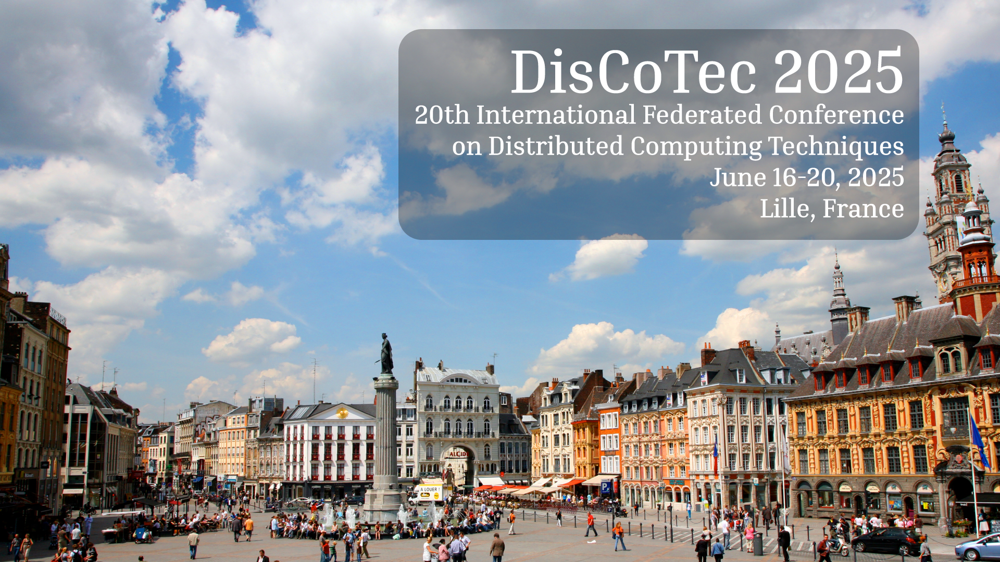

*Photo by *

# DisCoTec 2025 - 20th International Federated Conference on Distributed Computing Techniques

Welcome to DisCoTec 2025! 

[DisCoTec](/) is one of the major events sponsored by the International Federation for Information Processing ([IFIP](http://www.ifip.org)) and the European Association for Programming Languages and Systems ([EAPLS](https://eapls.org)).

DisCoTec 2025 will take place in [Lille, France](venue), June 9-13, 2025, hosted by 

## Quick Links
* [Venue](#venue)
* [Programme](./programme.md)
* [Keynote Speakers](#keynote-speakers)
* [Main Conferences](#main-conferences)
* [Best Papers](#best-papers)
* [Workshops](#satellite-events)
* [Proceedings](#proceedings)
* [Invoices and Certificates](./registration.md)

## Venue: Lille, France
### Conference Location
TBA

### More Information
See detailed information about Lille [here](venue). 
## Main Conferences
DisCoTec gathers conferences that cover a broad spectrum of distributed computing subjects — from theoretical foundations and formal description techniques, testing and verification methods, to language design and system implementation approaches:

* [COORDINATION 2025](coordination) - International Conference on Coordination Models and Languages
* [DAIS 2025](dais) - International Conference on Distributed Applications and Interoperable Systems
* [FORTE 2025](forte) - International Conference on Formal Techniques for Distributed Objects, Components, and Systems

## Satellite Events

DisCoTec 2025 will include workshops on a broad spectrum of distributed computing subjects.

<!--
Satellite events will take place on Monday, June 9, 2025, and on Friday, June 13, 2025.
-->

#### Important Dates
TBA

## Keynote Speakers
TBA

Go to the [dedicated page](./invited) for details on these keynote lectures.

## Programme
Go to the [programme page](./programme) for detailed information.

## Proceedings
The proceedings of the main conferences will be published as volumes in the [Springer LNCS-IFIP](https://www.springer.com/series/8345) series. 

The volumes will be **open access** from the [IFIP digital library](https://hal.inria.fr/IFIP/page/conferences) after a 3-year embargo.

The proceedings are freely accessible for the duration of the conference.

## Best Papers
TBA

## Journal Special Issues
Selected papers accepted at the main conferences will be invited for submission to special issues in high-quality journals: 
* [Logical Methods in Computer Science](https://lmcs.episciences.org) 
* [Science of Computer Programming](https://www.journals.elsevier.com/science-of-computer-programming/) ([Software Track](https://www.journals.elsevier.com/science-of-computer-programming/call-for-software/a-new-software-track-on-original-software-publications-science-of-computer-programming)).

Please visit the page of each conference for details on these special issues.

## Important Dates (All Conferences)
TBA

<!--

## Accepted Papers

Go to the [list of accepted papers](./accepted-papers).

## Welcome reception venue

TBA

## Dinner venue

TBA

## How to get from the airport to the conference venue

### Subway (Metro)
-->

--
## Registration
At least one author of papers/presentations accepted to the DisCoTec events (main conferences and workshops) must register by the early registration date.

The interface for registration will be available at the [registration page](./registration).

Important dates: TBA

## Accommodation

We strongly recommend booking a room **as soon as possible**: mid June is a busy period in the Lille area.

The DisCoTec events will take place on the Campus Scientifique, which is located south-east of Lille in Villeneuve d'Ascq. The campus is about 7 km from the city center, where most hotels are located. We recommend staying in the center, as there is a  good metro connection with the campus. 

You can book accommodation using well-known platforms such as [booking.com](https://www.booking.com) and [airbnb](https://www.airbnb.com).

We are working on special arrangements for DisCoTec participamts; details will be made available as soon as possible.
 
Alternatively, we intend to block a limited number of rooms in selected hotels for DisCoTec participants. These rooms will be available on a first-come, first-served basis. To get details about prices and secure your booking, please check [here](./hotels).

## Satellite Events

The pre-conference events will take place on Monday, June 9, 2025, and post-conference events on Friday, June 13, 2025.

[Call for Satellite Events Proposals](csep.md): We invite the community to submit proposals for tutorials on topics related to the distributed computing field.

### Important Dates
TBA
<!--
For all workshops:
- **Workshop proposal submission deadline:** ~~January 30, 2023~~ February 13, 2023 (Extended)
- **Notification of accepted workshop proposals:** ~~February 2, 2023~~ February 16, 2023
- **Workshop paper submission deadline:** Mid April 2023
- **Notification of accepted workshop papers:** Mid May 2023
- **Workshops:** June 23, 2023

For all tutorials:
- **Tutorial proposal submission deadline:** ~~March 7, 2023~~ March 21, 2023 (Extended)
- **Notification of accepted tutorial proposals:** ~~March 14, 2023~~ March 31, 2023
- **Tutorials:** June 19 or 23, 2023

Pre-conference workshops and tutorials will take place on **Monday, June 19, 2023**, and post-conference tutorials on **Friday, June 23, 2023**.

### Tutorials
* [DisCoTec Tutorials](https://www.discotec.org/2023/tutorials) -  Tutorial sessions

### Workshops
* [ICE 2023](https://www.discotec.org/2023/ice) - Workshop on Interaction and Concurrency Experience
-->

## Scientific Committees

### COORDINATION Program Committee Chairs
* [Cinzia Di Giusto][CinziaWeb] (Université de Nice Sophia-Antipolis)
* [António Ravara][AntonioWeb] (IST - Technical University of Lisbon)

### DAIS Program Committee Chairs
* [Daniel Balouek][DanielWeb] (IMT Atlantique and INRIA, France)
* [Ibéria Medeiros][IberiaWeb] (University of Lisbon, Portugal)

### FORTE Program Committee Chairs
* [Carla Ferreira][CarlaWeb] (NOVA University of Lisbon, Portugal)
* [Claudio Mezzina][ClaudioWeb] (University of Urbino, Italy)

### DisCoTec Artefact Evaluation Chair
<!--
* [Roberto Casadei][RobertoWeb] (University of Bologna, IT)
-->

## Organizing Committee
* [Simon Bliudze][SimonWeb] (Inria Center of the University of Lille, FR — **General Chair**)

[CinziaWeb]: https://webusers.i3s.unice.fr/~cdigiusto/web/
[AntonioWeb]: http://ctp.di.fct.unl.pt/~aravara/

[DanielWeb]: https://daniel-balouek.com/
[IberiaWeb]: https://di.fc.ul.pt/~imedeiros/

[CarlaWeb]: http://ctp.di.fct.unl.pt/~cf/
[ClaudioWeb]: https://sites.google.com/view/claudio-mezzina/home

[SimonWeb]: https://www.bliudze.me/simon

[RobertoWeb]: https://www.unibo.it/sitoweb/roby.casadei/

## Steering Committee 
* Gianluigi Zavattaro (University of Bologna, IT — Chair)
* Rocco De Nicola (IMT School for Advanced Studies Lucca, IT)
* Adrian Francalanza (University of Malta, MT)
* Kurt Geihs (University of Kassel, DE)
* Ivan Lanese (University of Bologna/INRIA, IT)
* Alberto Lluch Lafuente (Technical University of Denmark, DK)
* Mieke Massink (CNR-ISTI, IT)
* Elie Najm (Telecom Paris Tech, FR)
* Manuel Núñez (Universidad Complutense de Madrid, ES)
* Luís Veiga (INESC-ID, Universidade de Lisboa, PT)

<!--
## Advisory Board
* Alain Girault (INRIA Grenoble, FR)
* Uwe Nestmann (TU Berlin, DE)
* Michele Loreti (University of Camerino, IT)
* Jim Dowling (RISE & KTH, SE)
* Marjan Sirjani (University of Malarden, SE)
* Frank de Boer (Centrum Wiskunde & Informatica (CWI), NL)
* Farhad Arbab (Centrum Wiskunde & Informatica (CWI), NL)
* Lea Kutvonen (University of Helsinki, FI)
* John Derrick (University of Sheffield, UK)
* Pascal Felber (University of Neuchâtel, CH)
* Kostas Magoutis (ICS-FORTH, GR)
* Rui Oliveira (University of Minho, PT)
* Jean-Bernard Stefani (INRIA Grenoble, FR)
-->

## Further Information
* Please contact the general chair ([Simon Bliudze][SimonWeb]).
* Follow us on [@DisCoTecConf](https://twitter.com/DisCoTecConf) to keep up to date.

## Sponsors & Supporters

