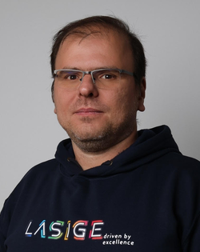
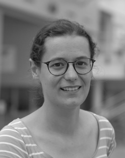
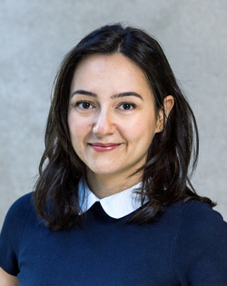

# Keynote Talks

DisCoTec 2025 will host keynote talks by [Alysson Bessani](#alysson-bessani), [Hélène Coullon](#hélène-coullon), and [Burcu Ozkan](#burcu-ozkan).

## [Alysson Bessani](https://ciencias.ulisboa.pt/en/perfil/anbessani) (Universidade de Lisboa, Portugal)
{: .keynote}
Alysson Bessani is a professor of the University of Lisbon Faculty of Sciences, Portugal, and the director of the LASIGE research unit.
He received his Ph.D. in Electrical Engineering from UFSC (Brazil) in 2006, was a visiting professor at Carnegie Mellon University (2010) and a visiting researcher at Microsoft Research Cambridge (2014). 
Alysson coordinated/collaborated in 13 international projects and co-authored more than 120 peer-reviewed publications on dependability, security, Byzantine fault tolerance, and cloud storage.
He is also the principal researcher behind the [BFT-SMaRt consensus library](http://bft-smart.github.io/library/) and a co-founder of the [Vawlt dependable & secure cloud storage](https://vawlt.io) startup. More information about him can be found at [http://www.di.fc.ul.pt/~bessani](http://www.di.fc.ul.pt/~bessani).

## [Hélène Coullon](http://helene-coullon.fr/) (IMT Atlantique, France)
{: .keynote}
Title and abstract TBD.
<!-- Date, time, and location TBD. -->

## [Burcu Ozkan](https://burcuku.github.io/home/) (TU Delft, The Netherlands)
{: .keynote}
Title and abstract TBD.
<!-- Date, time, and location TBD. -->
