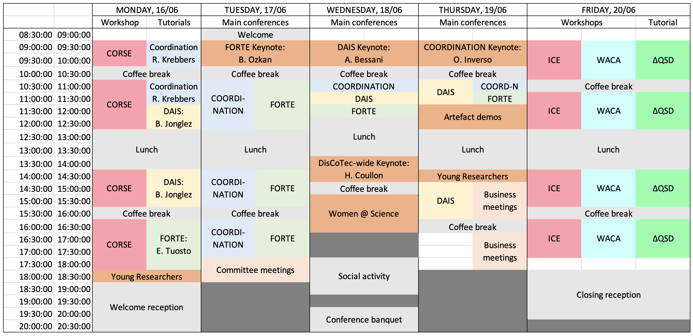

## Quick links
* [Programme in a Nutshell](#in-a-nutshell)
* [Details of the Parallel Tracks (Main Conferences)](#details-tuesday---thursday)

# Programme overview

## In a nutshell

TBA

<!--

### Tuesday, June 17th: Main Conferences

### Wednesday, June 18th: Main Conferences

### Thursday, June 19th: Main Conferences

-->

## Details (Tuesday - Thursday)

### Tuesday, June 17th: DisCoTec Main Conferences

| Time | COORDINATION | FORTE |
| :---: | :---: | :---: |
| *08:30-09:00*  | *Opening Ceremony DisCoTec 2025* | *Opening Ceremony DisCoTec 2025* |
|  | **FORTE Invited Talk**   (Room: TBA) | **FORTE Invited Talk**   (Room: TBA) |
| **09:00-10:00**  | [**Burcu Kulahcioglu Ozkan**:   From Formal Methods to Testing of Distributed Systems](./invited#burcu-kulahcioglu-ozkan-tu-delft-the-netherlands---forte) | [**Burcu Kulahcioglu Ozkan**:   From Formal Methods to Testing of Distributed Systems](./invited#burcu-kulahcioglu-ozkan-tu-delft-the-netherlands---forte) |
| *10:00-10:30* | *coffee break* | *coffee break* |
| | **COORDINATION**   (Room: TBA) | **FORTE**   (Room: TBA) |
| | **Session 1: Choreographic Approaches**   Chair: TBA | **Session 1: Verification**   Chair: TBA |
| **10:30-11:00** | Decidability Problems for Micro-Stipula | Temporal and Spatial Fault Detection for Connected Cyber-Physical Systems |
| **11:00-11:30** | DACEO: Declarative Asynchronous Choreographies with Data-dependent Event Ordering | Sequential Composition of BDD Transition Systems for Model-Based Testing |
| **11:30-12:00** | Behavioural, Functional, and Non-Functional Contracts for Dynamic Selection of Services | Scaling Information Flow Control by-Construction to Component-based Software Architectures |
| **12:00-12:30** | Dialects for the CoAP IoT Messaging Protocol | Probabilistic Safety Verification of Distributed Systems: A Statistical Approach for Monitoring |
| *12:30-13:30* | *lunch break* | *lunch break* |
| | **Session 2: Orchestrator Approaches**   Chair: TBA | *lunch break* |
| **13:30-14:00** | RebeCaos | **Session 2: Concurrency**   Chair: TBA |
| **14:00-14:30** | Declarative Deployment Planning for Green Pulverised Collective Computational Systems | Noninterference Analysis of Stochastically Timed Reversible Systems |
| **14:30-15:00** | Formal Foundations for Reowolf: Multi-Party Sessions via Synchronous Protocol Programming | Attribute-based Communication over Pub/Sub: Transactional Coordination for Smart Systems |
| **15:00-15:30** | MIMOSA: A Language for Asynchronous Implementation of Embedded Systems Software | An Approach to Formalize Information-theoretic Security of Multiparty Computation Protocols |
| *15:30-16:00* | *coffee break* | *coffee break* |
| | **Session 3: Tools and expressiveness**   Chair: TBA | **Session 3: Applications**   Chair: TBA |
| **16:00-16:30** | A Demonstrator Toolchain for Self-organizing Robot Teams | Choreographies for Program Understanding |
| **16:30-17:00** | Formalizing Errors in CCS with 3-Valued Logic | SNexpression: a new component for SN matrix-based structural analysis |
| **17:00-17:30** | A Constraint Opinion Model | Assessing Code Understanding in LLMs |
| **17:30-18:30** | **Committee meetings**   (Room: TBA) | **Committee meetings**   (Room: TBA) |

### Wednesday, June 18th: DisCoTec Main Conferences

| Time | DisCoTec |
| :---: | :---: |
|  | **DAIS Invited Talk**   (Room: TBA) |
| **09:00-10:00**  | [**Alysson Bessani**:   TBA](./invited#alysson-bessani-universidade-de-lisboa-portugal---dais) |
| *10:00-10:30* | *coffee break* |
|  | **Session 4: DisCoTec Best Papers**   (Room: TBA)    Chair: TBA |
| **10:30-11:00** | Verified Parameterized Choreographies |
| **11:00-11:30** | Revisited Convergence of a Self-Stabilizing BFS Spanning Tree Algorithm |
| **11:30-12:00** | TBA |
| *12:00-13:30* | *lunch break* |
|  | **DisCoTec-wide Keynote**   (Room: TBA) |
| **13:30-14:30**  | [**Hélène Coullon**:   TBA](./invited##hélène-coullon-imt-atlantique-france---discotec-wide) |
| *14:30-15:00* | *coffee break* |
| **15:00-16:30** | **Women @ Science**   (Room: TBA) |
| *17:30-19:00* | *Social activity* |
| *19:30-21:00* | *Conference banquet* |

### Thursday, June 19th: DisCoTec Main Conferences

| Time | DAIS | FORTE |
| :---: | :---: | :---: |
|  | **COORDINATION Invited Talk**   (Room: TBA) | **COORDINATION Invited Talk**   (Room: TBA) |
| **09:00-10:00**  | [**Omar Inverso**:   Towards Automated Analysis of Emerging Behaviour: Preliminary Insights and Research Directions](./invited#omar-inverso-gssi-italy---coordination) | [**Omar Inverso**:   Towards Automated Analysis of Emerging Behaviour: Preliminary Insights and Research Directions](./invited#omar-inverso-gssi-italy---coordination) |
| *10:00-10:30* | *coffee break* | *coffee break* |
| | **Session 5: DAIS**   (Room: TBA)   Chair: TBA | **Session 5: FORTE**   (Room: TBA)   Chair: TBA |
| **10:30-11:00** | | LolaPrompts: Assisting the General Public in Performing Real-Driving Emission Tests |
| **11:00-11:30** | | Towards Efficient Verification of Parallel Applications with Mc SimGrid |
| | **Joint Session: Artefact demos**   (Room: TBA) | **Joint Session: Artefact demos**   (Room: TBA) |
| **11:30-12:30** | Demos | Demos |
| *12:30-14:00* | *lunch break* | *lunch break* |
| **14:00-14:30** | **Young researchers**   (Room: TBA) | **Young researchers**   (Room: TBA) |
| **14:30-16:00** | **Session 6: DAIS**   (Room: TBA)   Chair: TBA | **Business meetings**   (Room: TBA) |
| *16:00-16:30* | *coffee break* | *coffee break* |
| **16:30-18:00** | | **Business meetings**   (Room: TBA) |