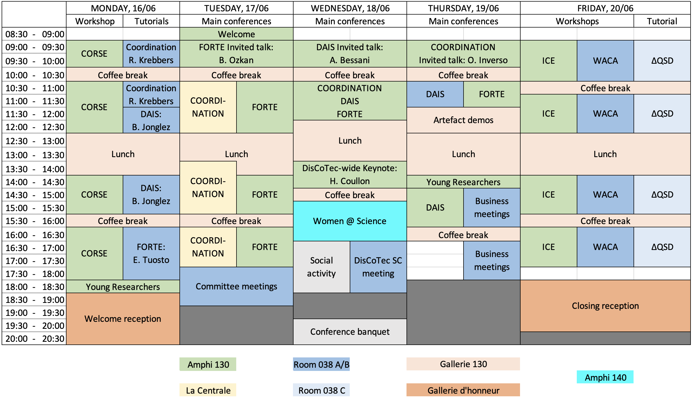

## Quick links
* [Programme in a Nutshell](#in-a-nutshell)
* [Details of the Parallel Tracks (Main Conferences)](#details-tuesday---thursday)

# Programme overview

## In a nutshell

### Monday, June 16th

* [Components Operationally: Reversibility and System Engineering](./satellite/corse) (CORSE) workshop
    * **Where:** Amphi 130 (upstairs)
    * **When:** 09:00-18:00
* [Driving distributed system experiments on the edge-to-cloud continuum with EnOSlib](./invited#baptiste-jonglez-inria-france---dais) DAIS tutorial
    * **Where:** Room 038 (downstairs)
    * **When:** 11:30-15:30
* [Mechanized Type Soundness for Substructural Types using Iris](./invited#robbert-krebbers-radboud-university-nijmegen-the-netherlands---coordination) COORDINATION tutorial
    * **Where:** Room 038 (downstairs)
    * **When:** 09:00-11:30
* [A choreographic view of Smart Contracts](./invited#emilio-tuosto-gssi-italy---forte) FORTE tutorial
    * **Where:** Room 038 (downstairs)
    * **When:** 16:00-18:00

### Tuesday, June 17th: Main Conferences

* Opening (**08:30**) and invited talk: [Burcu Kulahcioglu Ozkan](./invited#burcu-kulahcioglu-ozkan-tu-delft-the-netherlands---forte) (**09:00**)
   * Amphi 130 (upstairs)
* Contributed papers in two tracks: 
   * COORDINATION: Room Centrale (downstairs)
   * FORTE: Amphi 130

### Wednesday, June 18th: Main Conferences

* Invited talk: [Alysson Bessani](./invited#alysson-bessani-universidade-de-lisboa-portugal---dais) (**09:00**)
* Joint best paper session (**10:30**)
* Invited talk: [Hélène Coullon](./invited##hélène-coullon-imt-atlantique-france---discotec-wide) (**13:30**)
* Women @ Science (**15:00**)
   * Amphi 130 (upstairs)
* Social activities:
    * Excursion: surprise?
    * Dinner: surprise?

### Thursday, June 19th: Main Conferences

* Invited talk: [Omar Inverso](./invited#omar-inverso-gssi-italy---coordination) (**09:00**)
* Contributed papers in two tracks: 
   * DAIS: Room 038C (downstairs)
   * FORTE: Amphi 130
* Young researchers (**14:00**)

### Friday, June 20th

* [18th Interaction and Concurrency Experience](./satellite/ice) (ICE) workshop
    * **Where:** Amphi 130 (upstairs)
    * **When:** 09:00-17:30
* [Workshop on Adaptable Cloud Architectures](https://waca-ws.github.io/2025/)
    * **Where:** Room 038AB (downstairs)
    * **When:** 09:00-17:30
* [The ∆QSD Paradigm: Designing Systems with Predictable Performance at High Load](./satellite/DQSD) (∆QSD) tutorial
    * **Where:** Room 038C (downstairs)
    * **When:** 09:00-17:30

## Details (Tuesday - Thursday)

### Tuesday, June 17th: DisCoTec Main Conferences

| Time | COORDINATION | FORTE |
| :---: | :---: | :---: |
| *08:30-09:00*  | *Opening Ceremony DisCoTec 2025*   (Room: Amphi 130) | *Opening Ceremony DisCoTec 2025*   (Room: Amphi 130) |
|  | **FORTE Invited Talk**   (Room: Amphi 130) | **FORTE Invited Talk**   (Room: Amphi 130) |
| **09:00-10:00**  | [**Burcu Kulahcioglu Ozkan**:   From Formal Methods to Testing of Distributed Systems](./invited#burcu-kulahcioglu-ozkan-tu-delft-the-netherlands---forte) | [**Burcu Kulahcioglu Ozkan**:   From Formal Methods to Testing of Distributed Systems](./invited#burcu-kulahcioglu-ozkan-tu-delft-the-netherlands---forte) |
| *10:00-10:30* | *coffee break* | *coffee break* |
| | **COORDINATION**   (Room: Centrale) | **FORTE**   (Room: Amphi 130) |
| | **Session 1: Choreographic Approaches**   Chair: Maurice H. ter Beek | **Session 1: Verification**   Chair: Marco Bernardo |
| **10:30-11:00** | Decidability Problems for Micro-Stipula | Temporal and Spatial Fault Detection for Connected Cyber-Physical Systems |
| **11:00-11:30** | DACEO: Declarative Asynchronous Choreographies with Data-dependent Event Ordering | Sequential Composition of BDD Transition Systems for Model-Based Testing |
| **11:30-12:00** | Behavioural, Functional, and Non-Functional Contracts for Dynamic Selection of Services | Scaling Information Flow Control by-Construction to Component-based Software Architectures |
| **12:00-12:30** | Dialects for the CoAP IoT Messaging Protocol | Probabilistic Safety Verification of Distributed Systems: A Statistical Approach for Monitoring |
| *12:30-13:30* | *lunch break* | *lunch break* |
| | **Session 2: Orchestrator Approaches**   Chair: Carolyn Talcott | *lunch break* |
| **13:30-14:00** | RebeCaos | **Session 2: Concurrency**   Chair: Ivan Lanese |
| **14:00-14:30** | Declarative Deployment Planning for Green Pulverised Collective Computational Systems | Noninterference Analysis of Stochastically Timed Reversible Systems |
| **14:30-15:00** | Formal Foundations for Reowolf: Multi-Party Sessions via Synchronous Protocol Programming | Attribute-based Communication over Pub/Sub: Transactional Coordination for Smart Systems |
| **15:00-15:30** | MIMOSA: A Language for Asynchronous Implementation of Embedded Systems Software | An Approach to Formalize Information-theoretic Security of Multiparty Computation Protocols |
| *15:30-16:00* | *coffee break* | *coffee break* |
| | **Session 3: Tools and expressiveness**   Chair: Mieke Massink | **Session 3: Applications**   Chair: Claudio A. Mezzina |
| **16:00-16:30** | A Demonstrator Toolchain for Self-organizing Robot Teams | Choreographies for Program Understanding |
| **16:30-17:00** | Formalizing Errors in CCS with 3-Valued Logic | SNexpression: a new component for SN matrix-based structural analysis |
| **17:00-17:30** | A Constraint Opinion Model | Assessing Code Understanding in LLMs |
| **17:30-18:30** | **Committee meetings**   (Room: 038) | **Committee meetings**   (Room: 038) |

### Wednesday, June 18th: DisCoTec Main Conferences

{: .wide-table}
| Time | DisCoTec |
| :---: | :---: |
|  | **DAIS Invited Talk**   (Room: Amphi 130) |
| **09:00-10:00**  | [**Alysson Bessani**:   TBA](./invited#alysson-bessani-universidade-de-lisboa-portugal---dais) |
| *10:00-10:30* | *coffee break* |
|  | **Session 4: DisCoTec Best Papers**   (Room: Amphi 130)    Chair: Simon Bliudze |
| **10:30-11:00** | Verified Parameterized Choreographies |
| **11:00-11:30** | Revisited Convergence of a Self-Stabilizing BFS Spanning Tree Algorithm |
| **11:30-12:00** | Justin: Hybrid CPU/Memory Elastic Scaling for Distributed Stream Processing |
| *12:00-13:30* | *lunch break* |
|  | **DisCoTec-wide Keynote**   (Room: Amphi 130) |
| **13:30-14:30**  | [**Hélène Coullon**:   Efficient Reconfigurations with Programmable Life Cycles: Contributions to Safety, Declarativity, and Decentralization](./invited##hélène-coullon-imt-atlantique-france---discotec-wide) |
| *14:30-15:00* | *coffee break* |
| **15:00-16:30** | **Women @ Science**   (Room: Amphi 130) |
| *17:30-19:00* | *Social activity* |
| *19:30-21:00* | *Conference banquet* |

### Thursday, June 19th: DisCoTec Main Conferences

| Time | DAIS | FORTE |
| :---: | :---: | :---: |
|  | **COORDINATION Invited Talk**   (Room: Amphi 130) | **COORDINATION Invited Talk**   (Room: Amphi 130) |
| **09:00-10:00**  | [**Omar Inverso**:   Towards Automated Analysis of Emerging Behaviour: Preliminary Insights and Research Directions](./invited#omar-inverso-gssi-italy---coordination) | [**Omar Inverso**:   Towards Automated Analysis of Emerging Behaviour: Preliminary Insights and Research Directions](./invited#omar-inverso-gssi-italy---coordination) |
| *10:00-10:30* | *coffee break* | *coffee break* |
| | **Session 5: DAIS**   (Room: 038C)   Chair: TBA | **Session 5: FORTE**   (Room: Amphi 130)   Chair: TBA |
| **10:30-11:00** | Integrating High-Resolution Particulate Matter Data for Urban Air Quality Forecasting | LolaPrompts: Assisting the General Public in Performing Real-Driving Emission Tests |
| **11:00-11:30** | Mitigating Cryptographic Bottlenecks of Low-latency BFT Protocols | Towards Efficient Verification of Parallel Applications with Mc SimGrid |
| | **Joint Session: Artefact demos**   (Room: 038AB) | **Joint Session: Artefact demos**   (Room: 038AB) |
| **11:30-12:30** | Demos | Demos |
| *12:30-14:00* | *lunch break* | *lunch break* |
| **14:00-14:30** | **Young researchers**   (Room: Amphi 130) | **Young researchers**   (Room: Amphi 130) |
| | **Session 6: DAIS**   (Room: 038C)   Chair: TBA | |
| **14:30-16:00** | AIoRT: AI-driven distributed system for heterogenous Internet of Robotic things in Sustainable Ecosystem    A critical review of mobile device-to-device communication    BCProf: Battery Consumption Profiler for Android Applications | **Business meetings**   (Room: 038AB) |
| *16:00-16:30* | *coffee break* | *coffee break* |
| **16:30-18:00** | | **Business meetings**   (Room: 038AB) |
