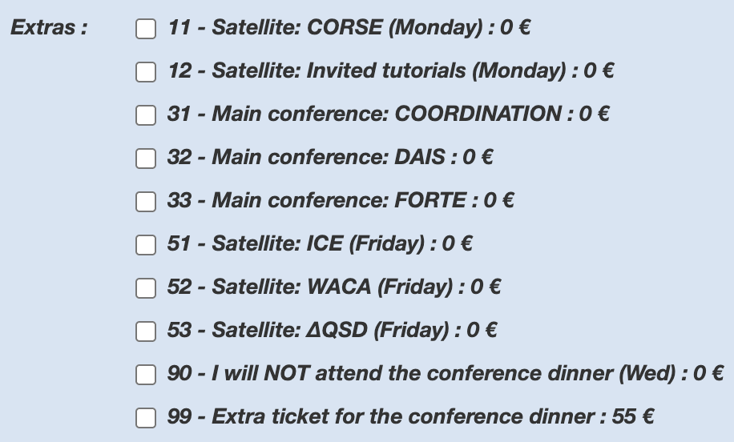

# Registration

## Important Dates
* Early registration: Possible until **May 23rd, 2025**, using the link below. 
* Late registration: Possible until **June 11th, 2025**, using the link below. 
* DisCoTeC 2025: **June 16th to 20th, 2025**.

## General Conditions 
* DisCoTec 2025 is planned as an on-site event.
* At least one author of papers/presentations accepted to the DisCoTec events (main conferences and workshops) must register by the early registration date.
* All registration fees below include 10% of VAT.
* Similar to past editions, there are --no special fees for students, but we have a limited amount of **student travel grants** provided by IFIP; see below for details.
* The online registration form will close after June 11th. If registering by this date is not possible, please contact the local organization (<discotec2025@inria.fr>) well in advance.
* In order to keep registration fees as low as possible, on-site registration and cancellations/refunds are not supported (see also below). 
* If you have any questions about the registration, please contact <discotec2025@inria.fr> (please, refer to “DisCoTec 2025 Registration” in the subject).

## Events and Fees

|   | Early (until May 23) | Late (until June 11) |
| - | -: | -: |
| **Full week** | EUR 650 | EUR 750 |
| **DisCoTec Conferences + 1 Satellite day** | EUR 615 | EUR 715 |
| **DisCoTec Conferences only** | EUR 550 | EUR 650 |
| **Satellite events only** | EUR 100 | EUR 100 |

## Description of categories
### Main conferences only
This category includes full access on Tuesday 17, Wednesday 18, and Thursday 19:
* Access to all Coordination, DAIS, and FORTE sessions 
* Access to the Gender Parity / Women in Science session
* Lunch and two coffee breaks
* Free access to the online LNCS proceedings of Coordination, DAIS, and FORTE
* Full social program on Wednesday 18 (social activities + conference banquet)

### Main conferences + 1 day satellites
This category includes
* All benefits of “Main conferences only” 
* Access to all workshops and tutorials on one of the satellite days (Monday 16 OR Friday 20)
* Lunch and two coffee breaks on the same day
* Welcome OR Closing reception

### Full week
This category includes 
* All benefits of “Main conferences only”
* Access to all workshops and tutorials on both satellite days (Monday 16 AND Friday 20)
* Lunch and two coffee breaks on the satellite days
* Welcome AND Closing reception

### Satellite events only
This category includes full access on Monday 16 AND Friday 20:
* Access to all workshops and tutorials on both satellite days
* Lunch and two coffee breaks on the satellite days
* Welcome AND Closing reception

**Note:** Additionally to the category selection, you *must* select the events you plan to attend, to help the organizing committee with logistics.

{:refdef: style="text-align: center; width: 50%;"}

{: refdef}

## Registration Link

You can register for DisCoTec by filling in the following form: [https://dr18.azur-colloque.fr/inscription/en/135/inscription](https://dr18.azur-colloque.fr/inscription/en/135/inscription).

<!-- The deadline for registration has passed. Registering online is no longer possible. -->

## Dietary restrictions
Do send an email to <discotec2025@inria.fr> with subject "Dietary restrictions" should you have any.

## Invoices
Upon completion of the registration process, you should automatically receive an invoice and/or proof of purchase. If you did not receive one, please send an email to <discotec2025@inria.fr> with subject "Invoice Request DisCoTec" indicating:
- your full name and email address; 
- the amount and the date on which you completed the online payment; 
- the exact information that you need to appear on it (institution, address, VAT number, etc)

## Visa Information

In case you need an invitation letter, after completing the registration process, please send your request to <discotec2025@inria.fr> (subject: “DisCoTec 2025 - Visa invitation letter”) by specifying the following details:

* Date in which you completed the registration and payment process
* Full name (as shown in your passport)
* Date of birth
* Snail mail address
* Professional e-mail address
* If you are presenting a paper: title of the paper, submission number, name of the conference/workshop
* Proof of student or professional status
* Passport number, expiration date, issuing country

We aim at processing letter requests quickly (via email), after having confirmed that registration has taken place. 

## Certificate of Attendance
If you registered and need a certificate of attendance, please send an email to <discotec2025@inria.fr> with subject "Certificate DisCoTec" indicating:
- your full name and institutional affiliation

We will reply with a certificate in PDF.

## Student Travel Grants 
Similar to past editions, there are no special fees for students but we have a limited amount of student travel grants provided by [IFIP](https://www.ifip.org) (subject to conditions). 

In order to apply to these grants, candidates should send their application (CV and a one-page motivation letter) via email to <discotec2025@inria.fr> with the subject “DisCoTec 2025 - student travel grant”. 

Applications should arrive by the early registration date, and will be handled on a first-come, first-served basis. 

## Cancellation/Refund Policy
In order to keep registration fees as low as possible, there will be no refunds in cases of cancellation. However, registered participants who have to cancel their participation may be substituted by another participant at no extra cost.
