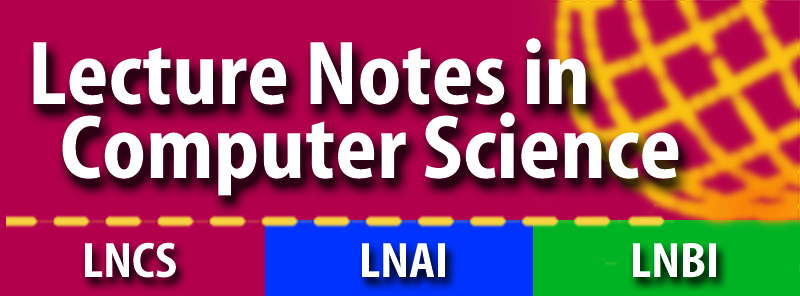

# COORDINATION 2025 - 27th International Conference on Coordination Models and Languages

COORDINATION 2025 is one of the three conferences of [DisCoTec 2025](.).

### Quick Links:
* [Important Dates](https://www.discotec.org/2025/dates)
<!-- * [Submission Categories](#categories-of-papers)-->
<!-- * [Submission Link](#submission-link) -->
* [Accepted Papers](#accepted-papers)
* [Proceedings and Special Issue](#proceedings-and-special-issues-from-previous-editions)
* [Programme Committee](#programme-committee)

## Scope
Modern information systems rely increasingly on combining concurrent, distributed, mobile, adaptive, reconfigurable and heterogeneous components. New models, architectures, languages and verification techniques are necessary to cope with the complexity induced by the demands of today’s software development. Coordination languages have emerged as a successful approach, in that they provide abstractions that cleanly separate behaviour from communication, therefore increasing modularity, simplifying reasoning, and ultimately enhancing software development. Building on the success of the previous editions, this conference provides a well-established forum for the growing community of researchers interested in models, languages, architectures, and implementation techniques for coordination.

## Main topics
Topics of interest encompass all areas of coordination, including (but not limited to) coordination related aspects of:
* Theoretical models and foundations for coordination: component composition, concurrency, distribution, mobility; dynamic, spatial and probabilistic aspects of coordination; logic, types, semantics.
* Coordination of multi-agent and collective systems: models, languages, infrastructures, self-adaptation, self-organisation, distributed solving, collective intelligence and emerging behaviour.
* Coordination and modern distributed computing: web services, microservices, peer-to-peer networks, grid computing, context-awareness, ubiquitous computing, mobile computing, reversible computing.
* Session-based programming: models, languages, behavioural types, and tools.
* Models, languages, verification techniques and tools for interacting smart contracts and (blockchain-based) decentralised applications.
* Languages, methodologies and tools for secure coordination. 
* Cybersecurity aspects of coordinated systems, coordinated approaches to cybersecurity.
* Nature- and bio-inspired approaches to coordination.
* Specification, refinement, and analysis of architectures: patterns and styles, verification of functional and non-functional properties, including performance and security aspects.
* Dynamic software architectures: distributed mobile code, configuration, reconfiguration, networked computing, parallel, high-performance and cloud computing.
* Coordination platforms for infrastructures of emergent new application domains, like IoT, fog- and edge-computing.
* Programming methodologies, languages, middleware, tools, and environments for the development and verification of coordinated applications, including DevOps approaches.
* Coordination in business process management: coordination models for business process management, process mining techniques and tools for coordination models.       
* Industrial relevance of coordination and software architectures: programming in the large, domain-specific software architectures and coordination models, industry-driven efforts in coordination and case studies.
* Interdisciplinary aspects of coordination.

## Accepted Papers 
Go to the [list of accepted papers](https://www.discotec.org/2025/accepted-papers).

## Submissions

### Submission categories:
* **Regular papers** (12-18 pages, not counting references and appendices): describing thorough and complete research results and experience reports. Regular papers may be combined with an artefact submission. Companion artefacts to regular submissions will be reviewed by the Artefact Evaluation Committee, but the acceptance of the paper is decoupled from the acceptance of the artefact (does not depend on it). The acceptance of the artefact, however, is conditional to the acceptance of the paper.

* **Survey papers** (16-25 pages, not counting references and appendices): describing important results and success stories related to the topics of COORDINATION.

* **Tool papers** (4-15 pages, not counting references and appendices): describing technological artefacts in the scope of the research topics of COORDINATION. Tool papers should provide a clear account of the tool's functionality, discuss the tool’s practical capabilities possibly with reference to the type and size of problems it can handle, and,when applicable, report on realistic case studies (possibly providing a rigorous experimental evaluation). Tool papers may also provide an account of the theoretical foundations, including relevant citations, and present design and implementation concerns, possibly including software architecture and core data structures. Papers that present extensions to existing tools should clearly describe the improvements or extensions with respect to previously published versions of the tool, possibly providing data on enhancements in terms of resources and capabilities. In addition, the tool artefact must be submitted separately for evaluation. Acceptance of the tool artefact is mandatory for tool papers to be accepted. The artefact will be evaluated by a dedicated committee. Papers may contain a link to a publicly downloadable MPEG-4 demo video of at most 10 minutes length.

### Artefact Submission Instructions 📣

We invite you to also submit an associated artefact for evaluation (AE). Artefacts such as ancillary data, tools, and software will be assessed for availability, functionality, and reusability badges.

Instructions on how to upload artefacts can be found [here](COORDINATION_Artefact_Evaluation_Guidelines.pdf).

As advertised in the call for papers, artefact submissions are mandatory for tool papers and optional for regular papers. Tool papers must submit an artefact that, at least, satisfies the requirements for the **Functional** badge. Papers not meeting this clause are rejected. Moreover, the acceptance of artefacts is conditional on the tool paper being accepted.

A selection of artefacts may be invited for submission to a special issue of Science of Computer Programming (SCP). For reference, see the selected artefacts published in the [SCP special issue from DisCoTec 2023](https://www.sciencedirect.com/special-issue/106HX5T86G0).

Choose the "COORDINATION Artefacts 2025" track in EasyChair when submitting your artefact.

### Submission link

Submission are via EasyChair at: [https://easychair.org/conferences/?conf=coordination2025](https://easychair.org/conferences/?conf=coordination2025)

### Publication

Publication of proceedings is coordinated among the three DisCoTec conferences (see the [Conferences](conferences) page for details). The [COORDINATION proceedings](https://link.springer.com/book/10.1007/978-3-031-95589-1 ) are published by Springer as an LNCS-IFIP volume and  comprise accepted submissions from __all__ categories.

### Proceedings and Special Issues from Previous Editions
**Proceedings**
The proceedings of previous editions of COORDINATION are available on [SpringerLink](https://link.springer.com/conference/coordination)

**Special Issues**
Special issues hosted by more recent editions of COORDINATION are listed below.

* Selected Papers of Coordination 2019,  Special Issue of Logical Methods in Computer Science, edited by Emilio Tuosto and Hanne Riis Nielsen. Available at: [https://lmcs.episciences.org/volume/view/id/377](https://lmcs.episciences.org/volume/view/id/377)

* Selected Tool Papers of Coordination 2019, Special Issue of Science of Computer Programming, edited by Hugo Torres Vieira and Omar Inverso. Available at: [https://www.sciencedirect.com/journal/science-of-computer-programming/special-issue/10H4835TWK9](https://www.sciencedirect.com/journal/science-of-computer-programming/special-issue/10H4835TWK9)

* Selected Papers of Coordination 2020, Special Issue of Logical Methods in Computer Science, edited by Simon Bliudze and Laura Bocchi. Available at: [https://lmcs.episciences.org/volume/view/id/415](https://lmcs.episciences.org/volume/view/id/415)

* Selected Papers of Coordination 2021, Special Issue of Logical Methods in Computer Science, edited by Ferruccio Damiani and Ornela Dardha. Available at: [https://lmcs.episciences.org/volume/view/id/449](https://lmcs.episciences.org/volume/view/id/449)

* Selected Tool Papers of Coordination 2020 and Coordination 2021, Special Issue of Science of Computer Programming, edited by Hugo Vieira, Omar Inverso and Giorgio Audrito. Available at: [https://www.sciencedirect.com/journal/science-of-computer-programming/special-issue/1046VCJSPCD](https://www.sciencedirect.com/journal/science-of-computer-programming/special-issue/1046VCJSPCD)

* Selected Papers of Coordination 2022, Special Issue of Logical Methods in Computer Science, edited by Maurice ter Beek and Marjan Sirjani. Available at: [https://lmcs.episciences.org/volume/view/id/654](https://lmcs.episciences.org/volume/view/id/654)

* Selected Software Artefacts from the Papers of DisCoTec 2022 - 17th International Federated Conference on Distributed Computing Techniques, Special Issue of Science of Computer Programming, edited by Ferruccio Damiani, David Eyers and Anna Philippou. Available at: [https://www.sciencedirect.com/special-issue/10CVGJGQP0Z](https://www.sciencedirect.com/special-issue/10CVGJGQP0Z).

* Selected Papers of Coordination and Forte 2023, Special Issue of Logical Methods in Computer Science, edited by Marieke Huisman, Sung-Shik Jongmans, Antónia Lopes, and António Ravara. In preparation.

* Selected Software Artefacts from the Papers of DisCoTec 2023 - 18th International Federated Conference on Distributed Computing Techniques, Special Issue of Science of Computer Programming. In preparation.

## Programme Committee

### Co-Chairs

* [Cinzia Di Giusto][CinziaWeb] (Université Côte d'Azur)
* [António Ravara][AntonioWeb] (NOVA School of Science and Technology)

<!--
## Publicity chair
* [Saverio Giallorenzo](https://www.unibo.it/sitoweb/saverio.giallorenzo2/) (University of Bologna, Italy)
-->

### Programme Committee members
* S. Akshay (IIT Bombay, India)	
* Étienne André	(Université Sorbonne Paris Nord, LIPN, CNRS UMR 7030, France)
* Giovanni Bacci (Dept. of Computer Science, Aalborg University, Denmark)
* Massimo Bartoletti (Dipartimento di Matematica e Informatica, Universita' degli Studi di Cagliari, Italy)	
* Georgiana	Caltais (University of Twente, Netherlands)
* Marco	Carbone (IT University of Copenhagen, Denmark)	
* Ilaria Castellani	(INRIA, France)
* Valentina Castiglioni (Eindhoven University of Technology, Netherlands)
* João Costa Seco (NOVA LINCS - NOVA University Lisbon, Portugal)
* Pedro R. D'Argenio (Universidad Nacional de Córdoba - CONICET, Argentina)
* Farzaneh Derakhshan (Illinois Tech University, USA)
* Silvia Ghilezan (University of Novi Sad, Mathematical Institute SASA, Serbia)
* Ludovic Henrio (CNRS, France)
* Thomas Hildebrandt (University of Copenhagen, Denmark)
* Daniel Hirschkoff	(ENS Lyon, France)
* Hanna	Klaudel	(IBISC, university of Evry, France)
* Eva Kühn (Vienna University of Technology, Austria)
* Carlos Gustavo Lopez Pombo (Escuela de Producción, Tecnologíay Medio Ambiente, Universidad Nacional de Río Negro and CONICET, Argentina)
* Roland Meyer (TU Braunschweig, Germany)
* Barbara Re (University of Camerino, Italy)
* Felix	Stutz (University of Luxembourg, Luxembourg)
* Meng Sun (Peking University, China)
* Carolyn Talcott (SRI International, USA)
* Frank Valencia (LIX, Ecole Polytechnique, France)
* Gianluigi Zavattaro (Department of Computer Science and Engineering - University of Bologna, Italy)
* Maurice ter Beek (CNR, Italy)

### Artefact Evaluation Committee chair
* Duncan Attard, University of Glasgow, UK

### Artefact Evaluation Committee
* Arwa Hameed Alsubhi, University of Glasgow, UK	
* Marietta Galea, University of Malta, Malta	
* Marco Giunti, University of Oxford, UK	
* Mário Pereira, NOVA University of Lisbon, Portugal
* Amrita Suresh, University of Oxford, UK	
* Gerard Tabone, University of Malta, Malta	
* Laura Voinea, University of Glasgow, UK	
* Jasmine Xuereb, University of Malta, Malta	

## Steering Committee
* Gul Agha (University of Illinois at Urbana Champaign, USA)
* Farhad Arbab (CWI and Leiden University, The Netherlands)
* Simon Bliudze (INRIA Lille, France)
* Laura Bocchi (University of Kent, UK)
* Ferruccio Damiani (University of Turin, Italy)
* Ornela Dardha (University of Glasgow, UK)
* Wolfgang De Meuter (Vrije Universiteit Brussels, Belgium)
* Rocco De Nicola (IMT School for Advanced Studies Lucca, Italy)
* Giovanna di Marzo Serugendo (Université de Genève, Switzerland)
* Tom Holvoet (KU Leuven, Belgium)
* Jean-Marie Jacquet (University of Namur, Belgium)
* Sung-Shik Jongmans (Open University of the Netherlands, Netherlands)
* Christine Julien (University of Texas at Austin, USA)
* Eva Kühn (Vienna University of Technology, Austria)
* Alberto Lluch Lafuente (Technical University of Denmark, Denmark)
* Antónia Lopes (University of Lisbon, Portugal)
* Michele Loreti (Università di Camerino, Italy)
* Mieke Massink (ISTI-CNR, Pisa, Italy) - chair
* José Proença (University of Porto, Portugal)
* Rosario Pugliese (Università di Firenze, Italy)
* Marjan Sirjani (Mälardalen University, Sweden)
* Carolyn Talcott (SRI International, California, USA)
* Maurice ter Beek (CNR-ISTI, Italy) 
* Francesco Tiezzi (Università di Firenze, Italy)
* Emilio Tuosto (Gran Sasso Science Institute, Italy)
* Vasco T. Vasconcelos (University of Lisbon, Portugal)
* Mirko Viroli (Università di Bologna, Italy)
* Gianluigi Zavattaro (Università di Bologna, Italy)

[CinziaWeb]: https://webusers.i3s.unice.fr/~cdigiusto/web/
[AntonioWeb]: https://nova-lincs.di.fct.unl.pt/people/?pid=411
