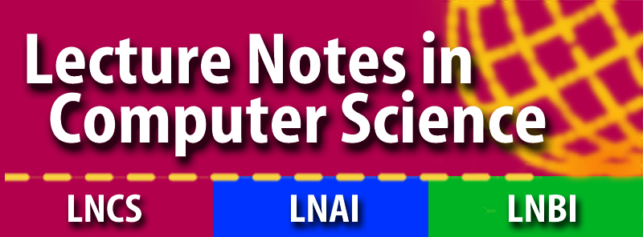

# FORTE 2026 - 46th International Conference on Formal Techniques for Distributed Objects, Components, and Systems

FORTE 2026 is one of the three conferences of [DisCoTec 2026](.), the 20th International Federated Conference on Distributed Computing Techniques.

### Quick Links:
* [Important Dates](https://www.discotec.org/2025/#important-dates)
* [Topics of Interest](#main-topics-of-interest)
* [Submission Categories](#categories-of-papers)
<!--* [Submission Link](#submission-link)-->
* [Accepted Pepers](#accepted-papers)
* [Publication](#Publication)
* [Special Issue](#special-issue)
* [Program Committee](#program-committee-chairs)
* [Contact](#more-information)

## Topics of Interest
FORTE 2026 is a forum for fundamental research on theory, models, tools, and applications for distributed systems.

We invite submissions focused on foundational aspects of distributed
software systems, presenting approaches or tools to formally model,
soundly implement, and rigorously validate these demanding but ever
more necessary systems and applications. As our dependency on such
software systems grow, also our responsibility as researchers grows to
provide both trustworthy and usable solutions.

The main topics of interest include:
* Language concepts for concurrency and distribution, supported by
  rigorous semantics, well-supported pragmatics, and/or expressive
  illustrative use-cases.
* Analyses techniques, methodologies, and/or algorithms, using testing
  and/or verification, to validate (aspects of) the soundness of
  various types of concurrent and distributed systems, including
  communication and network protocols, service-oriented systems,
  adaptive distributed systems, cyber-physical systems and sensor
  networks.
* Principles for qualitative and quantitative security analysis of
  distributed systems.
* Applications of formal methods and techniques for studying the
  quality, reliability, availability, and safety of concrete
  distributed systems. We are specially interested in "real-life" case
  studies and industrial applications involving real distributed
  systems.
* Emerging challenges and hot topics in distributed systems (broadly
  construed), such as software-defined networks, distributed ledgers,
  smart contracts, and blockchain technologies, etc.

## Submission and Publication

### Categories of Papers

We solicit papers in the following categories:
* __Regular papers__ (7-15 pages, not counting references): describing thorough and complete research results and experience reports. Regular papers may be combined with an artefact submission. Companion artefacts to regular submissions will be reviewed by the Artefact Evaluation Committee, but the acceptance of the paper is decoupled from the acceptance of the artefact (does not depend on it). The acceptance of the artefact, however, is conditional to the acceptance of the paper.
* __Tool papers__ (7-15 pages, not counting references): describing technological artefacts in the scope of the research topics of FORTE.  The paper should present the underlying theory of the tool, a clear account of the tool’s functionality and limitations, and include case studies (with rigorous experimental evaluation). In addition, the tool artefact must be submitted separately for evaluation. Acceptance of the tool artefact is mandatory for tool papers to be accepted. The artefact will be evaluated by a dedicated committee.  The paper must contain a link to a publicly downloadable MPEG-4 demo video of at most 10 minutes, to be submitted until a week after the paper submission deadline.
* __Short papers__ (up to 6 pages, not counting references): describing innovative and promising ideas, possibly in an early form, or demonstrating new tools (components), or presenting (i) calls to action, or (ii) substantiated reflections on current and/or future research perspectives related to FORTE, or a summary of a published journal paper clarifying why the presentation would enrich the program of FORTE.

## Artefact Submission Instructions 📣

We invite you to also submit an associated artefact for evaluation (AE). Artefacts such as ancillary data, tools, and software will be assessed for availability, functionality, and reusability badges.

Instructions on how to upload artefacts can be found [here](FORTE_Artefact_Evaluation_Guidelines.pdf).

As advertised in the call for papers, artefact submissions are mandatory for tool papers and optional for regular papers. Tool papers must submit an artefact that, at least, satisfies the requirements for the **Functional** badge. Papers not meeting this clause are rejected. Moreover, the acceptance of artefacts is conditional on the tool paper being accepted.

Choose the "FORTE 2026 Artefact Evaluation" track in EasyChair when submitting your artefact.

<!--### Submission Link
[Submission Link](https://easychair.org/conferences/?conf=forte2025)
  -->

<!--### Accepted papers
Go to the [**dedicated page**](accepted-papers)
-->
### Publication

Publication of proceedings is coordinated among the three DisCoTec conferences (see the [Conferences](conferences) page for details). The FORTE proceedings will be published by Springer as [LNCS-IFIP volume 15732] and will comprise accepted submissions from __all__ categories.

### Special Issue
<!--Selected papers will be invited to a special issue of [**Logical Methods in Computer Science**](https://lmcs.episciences.org).
-->

## Program Committee Chairs
* [Laura Bocchi][LauraWeb] (University of Kent, UK)
* [Burcu Kulahcioglu Ozkan][BurcuWeb] (TU Delft, The Netherlands)

## Program Committee Members

## Artefact Evaluation Committee chair

## Artefact Evaluation Committee

## Steering committee
* Christel Baier (University Dresden, Germany)
* Valentina Castiglioni (Eindhoven University of Technology, The Netherlands) 
* Adrian Francalanza (University of Malta, Malta)
* Marieke Huisman (University of Twente, The Netherlands)
* Ivan Lanese (University of Bologna/INRIA, Italy – Chair)
* Jorge A. Pérez (University of Groningen, The Netherlands) 
* Kirstin Peters (Technical University of Darmstadt, Germany) 
* Anna Philippou (University of Ciprus, Ciprus)
* Antonio Ravara (NOVA University of Lisbon, Portugal)
* Jean-Bernard Stefani (INRIA, France)
* Nobuko Yoshida (University of Oxford, UK) 

## More Information
For additional information, please contact the Program Committee Co-chairs: forte2026 at easychair dot org 

[BurcuWeb]: https://burcuku.github.io/home/
[LauraWeb]: https://www.kent.ac.uk/school-of-computing/people/3119/bocchi-laura
