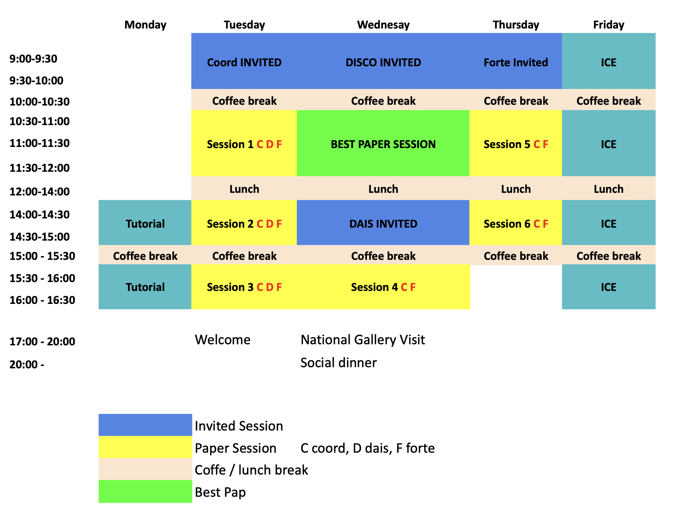

## Quick links
* [Programme in a Nutshell](#in-a-nutshell)
* [Details of the Parallel Tracks (Main Conferences)](#details-tuesday---thursday)

# Programme overview

## In a nutshell

### Monday, June 8th

*  COORDINATION tutorial
    * **Where:** Aula Magna
    * **When:** 14:00-17:00

### Tuesday, June 9th: Main Conferences

* Openning: -- (University of Urbino) (**08:30**) 
   * Aula Magna ()
* Invited talk: [Mehdi Dastani ](./invited#mehdi-dastani-utrecht-university-the-netherlands---coordination) (**09:00**)
   * Aula Magna
* Contributed papers in three tracks: 
   * COORDINATION: Aula Magna
   * FORTE: Sala del Consiglio
   * DAIS: Aula Amaranto
* Welcome party
   * Where:** Collegio Raffaello  (TBC)
   * **When: ** 18:00-20:00 **
  

### Wednesday, June 10th: Main Conferences

* Invited talk: [Roberto Bruni](./invited#roberto-bruni-university-of-pisa-italy---discotec-wide) (**09:00**)
* Joint best paper session (**10:30**)
* Invited talk: [Paolo Romano](./invited#paolo-romano-inesc-id-lisbon---distributed-systems-group-portugal---dais) (**14:00**)
* * Contributed papers in two tracks: 
   * COORDINATION: Aula Magna
   * FORTE:Sala del Consiglio
* Social activities:
    * Visit at the [National Painting Gallery](https://gndm.it/en/visit/?gad_source=1&gad_campaignid=22785201761&gbraid=0AAAABAahIOh4ERWcblCuwYKB_Dd3paO9l&gclid=CjwKCAjwtvvPBhBuEiwAPMijrz3Xlf3yWdaGBg8y6jOEAWV9TJlkkRLhoYLiqMNvrAnWzNCGu9ccxBoC4RsQAvD_BwE) &mdash; leaving directly from the conference venue.
    * Conference dinner at ragno d'oro

### Thursday, June 11th: Main Conferences

* Invited talk: [Nathalie Bertrand ](./invited#nathalie-bertrand-inria-france---forte) (**09:00**)
* * Contributed papers in two tracks: 
   * COORDINATION: Aula Magna
   * FORTE: Sala del Consiglio

### Friday, June 12th

* [19th Interaction and Concurrency Experience](./satellite/ice) (ICE) workshop
    * **Where:** Aula Magna 
    * **When:** 09:00-17:30

## Details (Tuesday - Thursday)

**COORDINATION**
* **S1 - Formal modeling and analysis of distributed systems**
   * Timed Scenario Expressions and Realisability
   * HistMSO: a Logic for Reasoning on Consistency Models with MONA
   * Motif Refinement for the Hierarchical Control of Structured CPSs

* **S2 - Formal verification in coordination languages**
   * Deductive Verification of Legal Contracts
   * Proof of Delivery: Mechanized Mailbox Types

* **S3 - Distributed algorithms for collective adaptive systems**
   * Aggregate Indoor Localisation
   * A Self-Stabilizing Min-Max Consensus via Path-loop Detection

* **BEST PAPER SESSION**
   * Runtime adaptation as a programming pattern in service composition

* **S4 - Simulation tools and methodologies for collective adaptive systems**
   * Simulation and Analysis of Indoor-Air-Quality Measuring Devices with YODA
   * High-Fidelity Simulation of Aggregate Computing Systems with Collektivity [tool]

* **S5 - Coordination languages, designs, and frameworks**
   * ScalaTropy: Multiparty Coordination with Monadic Communication Primitives
   * Bach4Popper: Towards Federated Inductive Logic Programming using Coordination
   * Phyelds: A Pythonic Framework for Aggregate Computing [tool]

**DAIS**
   * **S1 - Distributed Machine Learning**
      * Efficient Federated Search for Retrieval-Augmented Generation using Lightweight Routing
      * HyperCluster: Decentralized Large Language Model Inference over Peer-to-Peer Wireless Networks
      * Improving Federated Graph Recommendation with Semantic Guidance

* **S2 - Storage and Distributed Systems**
   * Graph-Matrix Model for Data Storage Systems
   * Orbitalis: A Distributed Microkernel Framework

* **S3 - IoT and Cyber-Physical Systems**
   * Heterogeneous Application Orchestration in Cyber-Physical Systems
   * An automated IoT-based infrastructure for real-time soil water deficit prediction
 
* BEST PAPER SESSION
      * **TBD**

**FORTE**
   * **S1 - Session types**
      * Deadlock-free Context-free Session Types
      * Binary and two-party asyncronous subtypings are equivalent
      * AsmetaComp: a Tool for Runtime Contract Checking with I/O Abstract State Machines

   * **S 2-3 - Timed systems**
      * TARZAN: A Region-Based Library for Forward and Backward Reachability of Timed Automata
      * TPTL-DIST: A Calculus for Verifying Real-Time Distributed Systems
      * A Jacobi-Based Distributed Clock Synchronization Algorithm for Wide-Area Networks
      * Robustness Against Time Distortions in STARK

   * BEST PAPER SESSION
      * Soundness of Typed Transitions in the Linear Pi Calculus

   * **S4 - Learning**
      * NeuroNL2LTL: A Neurosymbolic Framework for Natural Language Translation of Linear Temporal Logic
      * Automata Learning with an Incomplete but Inductive Teacher

* **S5 - Model checking & mechanization**
   * Harmony in Rocq
   * Control Flow-Based Symmetry Reduction for Parameterised Boolean Equation Systems
   * RustMC: Automated Verification of Real-World Concurrent Rust

* **S6 - Verification**
   * Sound Automatic Lock Placement for Concurrent Programs with Pointers
   * Formal Modeling of BEEFY, a Protocol for Supporting Light Clients
